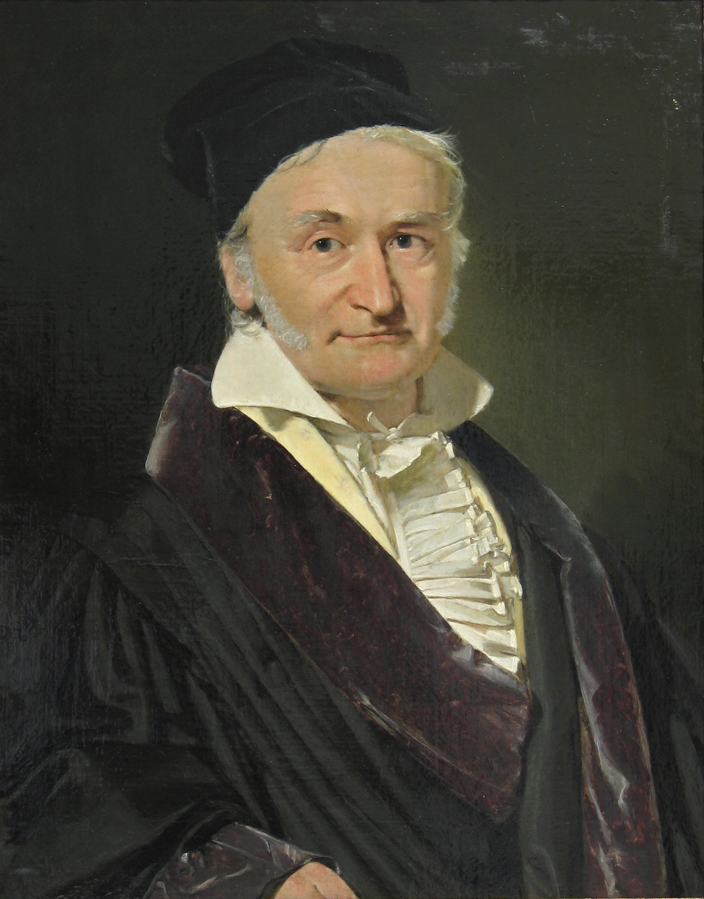
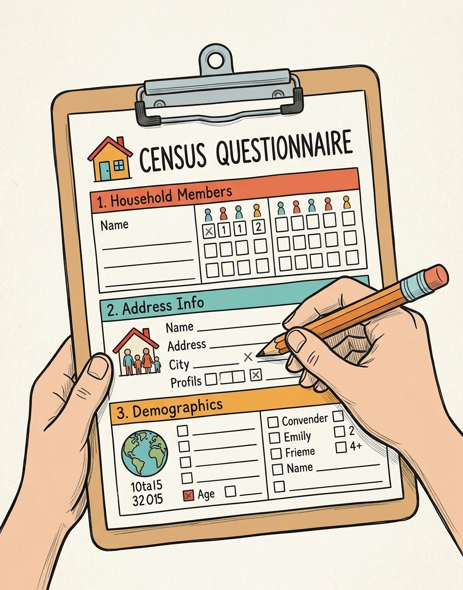
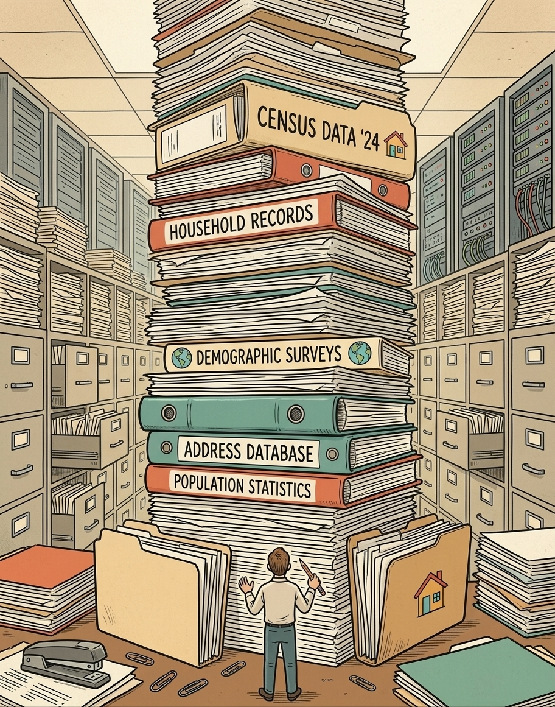
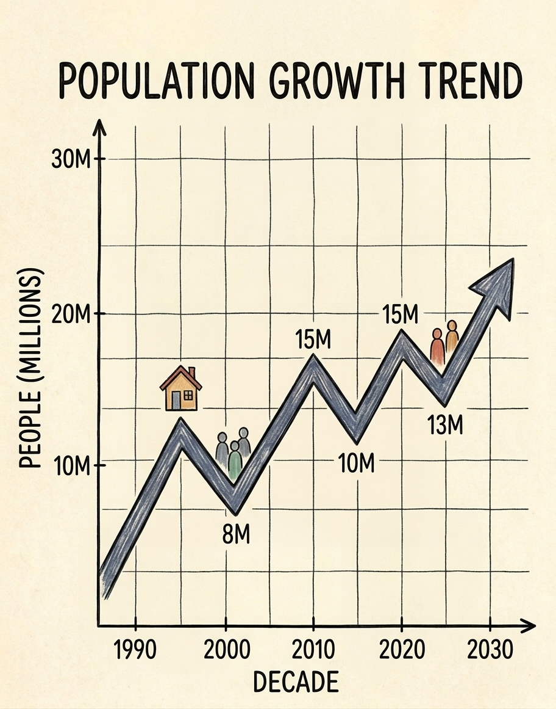
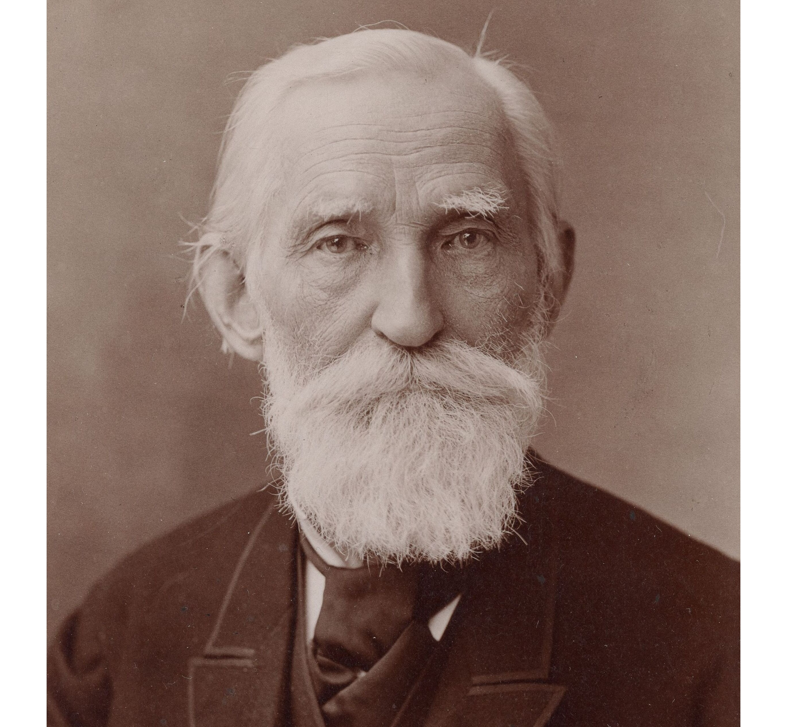
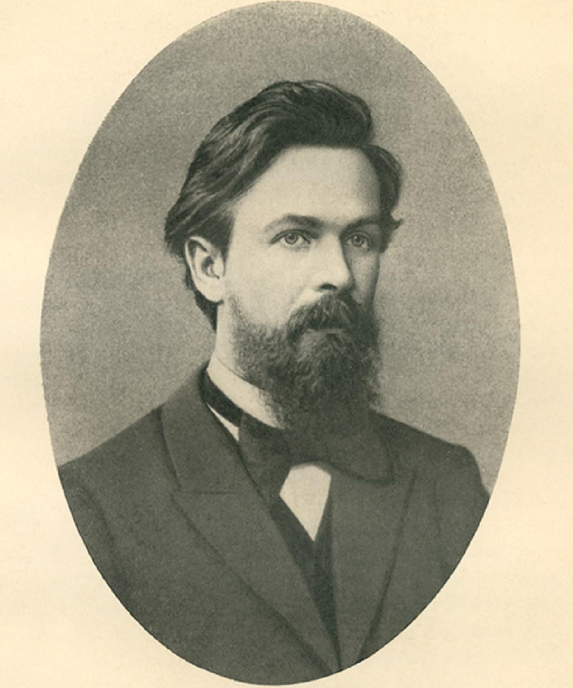

## Reasoning with data under uncertainty {.title-slide}

<div class="eyebrow">Week 1</div>

<div class="concept-line" style="margin-top:1em;">
Introduction to statistics.
</div>

## Would you approve this drug? {.motivation-slide .question-slide}

<div class="eyebrow">First decision</div>

<div class="compare-grid">
  <div class="metric-card observed-card">
  <div class="metric-label">New drug · response</div>
  <div class="metric-value observed">72%</div>
  </div>
  <div class="metric-card model-card">
  <div class="metric-label">Standard treatment · response</div>
  <div class="metric-value model">65%</div>
  </div>
</div>

<div class="big-question" style="margin-top:0.55em;">Approve?</div>

::: {.fragment .fade-up}
<div class="kicker"><strong>Suppose there were only 8 patients in each group.</strong></div>
:::

::: {.fragment .fade-up}
<div class="kicker"><strong>Now suppose there were 8,000 patients in each group.</strong></div>
:::

::: {.fragment .fade-up}
<div class="takeaway">The percentages did not change. The evidence did.</div>
:::

::: {.notes}
Do not define statistics yet. Ask for a show of hands after the two percentages.

After revealing n = 8, ask what additional information students now want. Typical answers: sample size, randomization, patient selection, uncertainty, side effects, effect size.

Then reveal n = 8,000. Emphasize that the same point estimate can carry very different evidential weight.

Teaching target: students should spontaneously discover that a number without context is insufficient.
:::

## So what is statistics? {.concept-slide}

<div class="eyebrow">A working definition for this course</div>

<div class="flow-row">
  <div class="flow-node observed">DATA</div>
  <div class="flow-arrow">→</div>
  <div class="flow-node probability">UNCERTAINTY</div>
  <div class="flow-arrow">→</div>
  <div class="flow-node estimate">LEARNING</div>
  <div class="flow-arrow">→</div>
  <div class="flow-node">DECISION</div>
</div>

::: {.fragment .fade-up}
<div class="concept-line">
Statistics is the science of <strong>learning from data</strong> in the presence of <strong>uncertainty</strong>.
</div>
:::

::: {.fragment .fade-up}
<div class="kicker" style="margin-top:0.8em;">
This course is not about memorizing a catalogue of tests. It is about learning how to ask what the data can — and cannot — tell us.
</div>
:::

<div class="timeline2">
  <div class="timeline2-step fragment fade-up">
  <div class="label">Jacob Bernoulli</div>
  
  </div>
  <div class="timeline2-step fragment fade-up">
  <div class="label">Carl Friedrich Gauss</div>
  
  </div>
  <div class="timeline2-step fragment fade-up">
  <div class="label">Ronald Aylmer Fisher</div>
  
  </div>
</div>

::: {.notes}
This is the semester-long working definition. Return to it in Week 12.

Point explicitly to the color grammar for the first time:
- blue = what we observed,
- purple = uncertainty/probability,
- green = what we learned/estimated.

Do not yet explain orange/red in detail; they will appear naturally later.
:::

## Where did statistics come from? {.concept-slide}

<div class="eyebrow">A 60-second historical aside</div>

<div class="big-question" style="font-size:1.18em; max-width:26ch;">
When states began systematically collecting information, data became a source of power.
</div>

<div class="timeline">
  <div class="timeline-step fragment fade-up">
  <div class="number">01</div>
  <div class="label">Population &amp; resources</div>
  
  </div>
  <div class="timeline-step fragment fade-up">
  <div class="number">02</div>
  <div class="label">Census &amp; records</div>
  
  </div>
  <div class="timeline-step fragment fade-up">
  <div class="number">03</div>
  <div class="label">Store &amp; summarize</div>
  
  </div>
  <div class="timeline-step fragment fade-up">
  <div class="number">04</div>
  <div class="label">Compare &amp; detect patterns</div>
  
  </div>
  <div class="timeline-step fragment fade-up">
  <div class="number">05</div>
  <div class="label">Decide &amp; govern</div>
  
  </div>
</div>

::: {.fragment .fade-up}
<div class="takeaway">
The word <em>statistics</em> historically comes from German <em>Statistik</em>: knowledge about the affairs of a state.
</div>
:::

::: {.notes}
Keep this short. The goal is not etymology; the goal is the durable idea that organized data collection changes what institutions can know and decide.
:::

## Statistics is already in your life {.example-slide}

<div class="eyebrow">Before pharmacy, before research</div>

<div class="life-grid">
  <div class="life-card fragment fade-up">
  <div class="life-title">Income</div>
  <div class="life-question">Mean or median — and why does the choice matter?</div>
  </div>
  <div class="life-card fragment fade-up">
  <div class="life-title">A health headline</div>
  <div class="life-question">“A study found…” — in how many people, and compared with what?</div>
  </div>
  <div class="life-card fragment fade-up">
  <div class="life-title">Insurance</div>
  <div class="life-question">What risk are you transferring, and what are you paying for it?</div>
  </div>
  <div class="life-card fragment fade-up">
  <div class="life-title">Relative risk</div>
  <div class="life-question">“50% higher risk” — 50% higher than what baseline?</div>
  </div>
</div>

::: {.fragment .fade-up}
<div class="concept-line" style="margin-top:0.65em;">
Statistical literacy is partly the ability to ask the missing question.
</div>
:::

::: {.notes}
Do not answer these questions fully. They are previews of later weeks.

Possible verbal examples:
- mean vs median income → Week 3 descriptive statistics;
- “study found” → sampling and design;
- insurance → expected value and decision theory;
- relative risk → Week 10 epidemiology.

This slide creates retrieval hooks that can be revisited later.
:::

## When bad statistics has consequences {.case-slide .checkpoint-slide}

<div class="warning-label">Case study · Sally Clark</div>

::: {.example-box}
A figure presented in court for the probability of a sudden infant death in a family like Clark's was approximately

::: {.case-equation .probability}
$$P(\text{one SIDS death}) \approx \frac{1}{8543}$$
:::

::: {.fragment .fade-up}
The probability of two deaths was then presented by multiplying the number by itself:

::: {.case-equation}
$$\frac{1}{8543}\times\frac{1}{8543}\approx\frac{1}{73\,000\,000}$$
:::
:::
:::

::: {.fragment .fade-up}
<div class="big-question" style="font-size:1.05em; margin-top:0.38em;">What assumption is hiding inside that multiplication?</div>
:::

::: {.fragment .fade-up}
<div class="assumption-chip">Do not solve this yet — we return to it after independence.</div>
:::

::: {.notes}
This is deliberately unresolved. The case will return after the independence slide later in Week 1.

Avoid turning this into a legal-history digression. The statistical point is that multiplication of probabilities encodes assumptions.

The Royal Statistical Society later criticized the calculation because independence was not justified and also warned against confusing P(evidence | hypothesis) with P(hypothesis | evidence).

Source for lecturer reference:
https://rss.org.uk/RSS/media/File-library/Membership/Sections/2020/Sally-Clark-RSS-letter-2002.pdf
:::

## Science needs statistics {.concept-slide}

<div class="eyebrow">Same nominal condition ≠ same observed outcome</div>

<div class="big-question" style="font-size:1.12em; max-width:28ch;">
Give the same treatment under the same nominal conditions. Why are the measured responses not identical?
</div>

<div class="response-strip" aria-label="Observed responses vary around an underlying model value">
  <div class="truth"></div>
  <div class="truth-label">underlying target / model</div>
  <div class="dot fragment fade-in" style="left:34%; top:30%;"></div>
  <div class="dot fragment fade-in" style="left:53%; top:42%;"></div>
  <div class="dot fragment fade-in" style="left:43%; top:76%;"></div>
  <div class="dot fragment fade-in" style="left:29%; top:70%;"></div>
  <div class="dot fragment fade-in" style="left:18%; top:64%;"></div>
  <div class="dot fragment fade-in" style="left:79%; top:45%;"></div>
  <div class="dot fragment fade-in" style="left:70%; top:37%;"></div>
  <div class="dot fragment fade-in" style="left:50%; top:60%;"></div>
  <div class="dot fragment fade-in" style="left:39%; top:55%;"></div>
  <div class="dot fragment fade-in" style="left:47%; top:34%;"></div>
  <div class="dot fragment fade-in" style="left:65%; top:57%;"></div>
  <div class="dot fragment fade-in" style="left:57%; top:72%;"></div>
  <div class="dot fragment fade-in" style="left:61%; top:28%;"></div>
  <div class="dot fragment fade-in" style="left:24%; top:40%;"></div>
  <div class="dot fragment fade-in" style="left:74%; top:67%;"></div>
  <div class="axis-label">measured response →</div>
</div>

<div class="flow-row" style="margin-top:1.1em;">
  <div class="flow-node fragment fade-up">Biological variability</div>
  <div class="flow-node fragment fade-up">Measurement error</div>
  <div class="flow-node fragment fade-up">Environment</div>
  <div class="flow-node fragment fade-up">Unknown factors</div>
</div>

::: {.fragment .fade-up}
<div class="concept-line" style="margin-top:0.62em;">
Scientific observations contain both <span class="estimate"><strong>signal</strong></span> and <span class="probability"><strong>uncertainty</strong></span>.
</div>
:::

::: {.notes}
Use a pharmaceutical example verbally: plasma concentration, clearance, blood-pressure response, dissolution time, assay signal, etc.

Important distinction: statistical uncertainty is not motivated primarily through the Heisenberg uncertainty principle, which is quantum-mechanical uncertainty and is not the same concept as biological variability, sampling variation, measurement error or incomplete knowledge.

This slide prepares the transition to probability.
:::

## The scientific learning loop {.concept-slide}

<div class="eyebrow">Reasoning under uncertainty is iterative</div>

<div class="loop-diagram">
  <div class="loop-node q fragment fade-up"><span>1</span>Question</div>
  <div class="loop-arrow fragment fade-in">→</div>
  <div class="loop-node e fragment fade-up"><span>2</span>Experiment</div>
  <div class="loop-arrow fragment fade-in">→</div>
  <div class="loop-node d fragment fade-up"><span>3</span>Data</div>
  <div class="loop-arrow fragment fade-in">→</div>
  <div class="loop-node m fragment fade-up"><span>4</span>Model</div>
  <div class="loop-arrow fragment fade-in">→</div>
  <div class="loop-node dec fragment fade-up"><span>5</span>Decision</div>
</div>

::: {.fragment .fade-up}
<div class="loop-return">Decision → new question → new data</div>
:::

::: {.fragment .fade-up}
<div class="concept-line">
Statistics sits inside the loop: it connects uncertain observations to defensible decisions.
</div>
:::

::: {.notes}
This is the course-level mental model.

Stress that the loop is not perfectly clean in real research. There are failed assays, noisy measurements, unexpected constraints, and judgment calls.
:::

## Enzyme engineering as a learning loop {.example-slide}

<div class="example-label">Pharmacy-adjacent example</div>

<div class="enzyme-stage">
  <div class="enzyme-box fragment fade-up">
  <div class="enzyme-icon">PET</div>
  <div class="enzyme-title">Problem</div>
  <div class="enzyme-text">Natural enzymes degrade PET too slowly.</div>
  </div>
  <div class="enzyme-arrow fragment fade-in">→</div>
  <div class="enzyme-box fragment fade-up">
  <div class="enzyme-icon model">MUT</div>
  <div class="enzyme-title">Generate variants</div>
  <div class="enzyme-text">Mutate enzyme sequence.</div>
  </div>
  <div class="enzyme-arrow fragment fade-in">→</div>
  <div class="enzyme-box fragment fade-up">
  <div class="enzyme-icon observed">ASSAY</div>
  <div class="enzyme-title">Observe</div>
  <div class="enzyme-text">Measure activity for many variants.</div>
  </div>
  <div class="enzyme-arrow fragment fade-in">→</div>
  <div class="enzyme-box fragment fade-up">
  <div class="enzyme-icon estimate">TOP 5%</div>
  <div class="enzyme-title">Select</div>
  <div class="enzyme-text">Keep the best performers.</div>
  </div>
</div>

<div class="assay-dots" aria-label="Assay results with top performers highlighted">
  <span class="blue-dot" style="left:3%; bottom:18%;"></span><span class="blue-dot" style="left:8%; bottom:24%;"></span><span class="blue-dot" style="left:12%; bottom:15%;"></span><span class="blue-dot" style="left:17%; bottom:34%;"></span>
  <span class="blue-dot" style="left:21%; bottom:27%;"></span><span class="blue-dot" style="left:26%; bottom:42%;"></span><span class="blue-dot" style="left:31%; bottom:31%;"></span><span class="blue-dot" style="left:36%; bottom:46%;"></span>
  <span class="blue-dot" style="left:41%; bottom:39%;"></span><span class="blue-dot" style="left:46%; bottom:50%;"></span><span class="blue-dot" style="left:52%; bottom:43%;"></span><span class="blue-dot" style="left:57%; bottom:58%;"></span>
  <span class="blue-dot" style="left:62%; bottom:52%;"></span><span class="blue-dot" style="left:68%; bottom:60%;"></span><span class="green-dot fragment fade-in" style="left:74%; bottom:68%;"></span><span class="green-dot fragment fade-in" style="left:80%; bottom:76%;"></span>
  <span class="green-dot fragment fade-in" style="left:86%; bottom:72%;"></span><span class="green-dot fragment fade-in" style="left:93%; bottom:84%;"></span>
  <div class="assay-xaxis">enzyme variant rank →</div>
  <div class="assay-yaxis">enzyme efficacy →</div>
</div>

::: {.fragment .fade-up}
<div class="takeaway">Observe → select → update → repeat.</div>
:::

::: {.notes}
Use this as an intuitive example of iterative empirical optimization. Do not over-teach enzyme engineering; the statistical idea is enough.

The key point is that noisy data still supports useful decisions when the process is structured.
:::

## Probability {.section-break .probability-break}

<div class="section-kicker">Part II</div>

<div class="section-title">The mathematical language of uncertainty</div>

<div class="section-subtitle">We now formalize the word “possible.”</div>

::: {.notes}
Pause here. Tell students that the course now becomes a little more technical, but the symbols will always refer to concrete objects.
:::

## Experiment → outcomes → events → probability {.concept-slide}

<div class="eyebrow">Start with one clinical experiment</div>

<div class="builder-grid">
  <div class="builder-card fragment fade-up">
  <div class="builder-label">Experiment</div>
  <div class="builder-main">Administer treatment</div>
  </div>
  <div class="builder-card fragment fade-up">
  <div class="builder-label">Possible outcomes</div>
  <div class="outcome-row">
  <span class="outcome-pill observed">Response</span>
  <span class="outcome-pill muted">No response</span>
  </div>
  </div>
  <div class="builder-card fragment fade-up">
  <div class="builder-label">Event</div>
  <div class="builder-main">$A = \{\text{response}\}$</div>
  </div>
  <div class="builder-card fragment fade-up">
  <div class="builder-label">Probability</div>
  <div class="builder-main probability">$\mathbb{P}(A) = 0.70$</div>
  </div>
</div>

::: {.fragment .fade-up}
<div class="concept-line">
Probability is a rule for assigning numbers to events before the uncertain outcome is observed.
</div>
:::

::: {.notes}
Do not start with coins. Start with a pharmacy-relevant two-outcome situation.

Clarify that response/no response is a simplification. Real clinical endpoints can be continuous, ordinal, binary, time-to-event, etc. We start binary because it lets us see the structure.
:::

## A probability space {.math-slide}

<div class="eyebrow">The ingredients</div>

<div class="ingredient-grid">
  <div class="ingredient-card fragment fade-up">
  <div class="math-symbol">$\Omega$</div>
  <div class="ingredient-title">Sample space</div>
  <div class="ingredient-text">all possible elementary outcomes</div>
  </div>
  <div class="ingredient-card fragment fade-up">
  <div class="math-symbol">$\mathcal{F}$</div>
  <div class="ingredient-title">Events</div>
  <div class="ingredient-text">questions we can ask about outcomes</div>
  </div>
  <div class="ingredient-card fragment fade-up">
  <div class="math-symbol">$\mathbb{P}$</div>
  <div class="ingredient-title">Probability measure</div>
  <div class="ingredient-text">a rule assigning probabilities to events</div>
  </div>
</div>

::: {.fragment .fade-up}
<div class="definition-box">
$$
\mathbb{P}:\mathcal{F} \rightarrow [0,1]
$$
</div>
:::

::: {.notes}
Keep sigma-algebra details out of the lecture. Say: in advanced probability, the event system has additional technical requirements; in this course, think of F as the events to which probabilities are assigned.

The message is: probability needs a universe of possible outcomes, a set of events, and a consistent assignment rule.
:::

## The sample space {.concept-slide}

<div class="eyebrow">Coin tosses: a clean toy model</div>

<div class="coin-layout">
  <div class="coin-panel fragment fade-up">
  <div class="coin-title">One toss</div>
  <div class="coin-space">$\Omega = \{\text{H},\text{T}\}$</div>
  <div class="coin-matrix">
  <div class="coin-row"><span class="coin">H</span></div>
  <div class="coin-row"><span class="coin">T</span></div>
  </div>
  </div>
  <div class="coin-panel fragment fade-up">
  <div class="coin-title">Two tosses</div>
  <div class="coin-space">$\Omega = \{\text{HH},\text{HT},\text{TH},\text{TT}\}$</div>
  <div class="coin-matrix">
  <div class="coin-row"><span class="coin">H</span><span>→</span><span class="coin">H</span><span class="coin">H</span></div>
  <div class="coin-row"><span class="coin">H</span><span>→</span><span class="coin">H</span><span class="coin">T</span></div>
  <div class="coin-row"><span class="coin">T</span><span>→</span><span class="coin">T</span><span class="coin">H</span></div>
  <div class="coin-row"><span class="coin">T</span><span>→</span><span class="coin">T</span><span class="coin">T</span></div>
  </div>
  </div>
</div>

::: {.fragment .fade-up}
<div class="warning-box">
For the first example, avoid adding “impossible” outcomes. Start with the outcomes the experiment actually defines.
</div>
:::

::: {.notes}
This cleans up the earlier draft idea. For one coin toss, Ω = {H, T}. For two coin tosses, Ω = {HH, HT, TH, TT}. Impossible outcomes and probability-zero events are more subtle and belong later when discussing continuous distributions.
:::

## Events are sets {.concept-slide}

<div class="eyebrow">Set-theoretic relations, made visible</div>

<div class="event-board">
  <div class="outcome-card highlight fragment fade-up">HH</div>
  <div class="outcome-card highlight fragment fade-up">HT</div>
  <div class="outcome-card highlight fragment fade-up">TH</div>
  <div class="outcome-card fragment fade-up">TT</div>
</div>

<div class="equation-row">
  <div class="eq-card fragment fade-up">$A = \{\text{at least one head}\}$</div>
  <div class="eq-card fragment fade-up">$A = \{\text{HH},\text{HT},\text{TH}\}$</div>
  <div class="eq-card fragment fade-up">$A^c = \{\text{TT}\}$</div>
</div>

::: {.fragment .fade-up}
<div class="mini-venn">
  <div class="venn-circle a">A</div>
  <div class="venn-circle b">B</div>
  <div class="venn-caption">union, intersection, complement are operations on events</div>
</div>
:::

::: {.notes}
The outcomes appear one by one. The first three are highlighted as event A. Then A and A complement are named.

Define union/intersection verbally with the Venn visual: A or B; A and B; not A.
:::

## Three rules are enough to start {.math-slide}

<div class="eyebrow">Kolmogorov axioms, introductory version</div>

<div class="axiom-portrait-grid">
  <!-- Left Column: Axioms -->
  <div class="axiom-stack">
  <div class="axiom fragment fade-up"><span class="axiom-number">1</span> $0 \leq \mathbb{P}(A) \leq 1$</div>
  <div class="axiom fragment fade-up"><span class="axiom-number">2</span> $\mathbb{P}(\Omega)=1$</div>
  <div class="axiom fragment fade-up"><span class="axiom-number">3</span> If $A$ and $B$ are disjoint: $\mathbb{P}(A\cup B)=\mathbb{P}(A)+\mathbb{P}(B)$</div>
  </div>
  <!-- Right Column: Portraits (New) -->
  <div class="mathematician-gallery fragment fade-up">
  <div class="portrait-card">
  
  <div class="portrait-name">Pafnuty Chebyshev</div>
  </div>
  <div class="portrait-card">
  
  <div class="portrait-name">Andrey Markov</div>
  </div>
  <div class="portrait-card">
  
  <div class="portrait-name">Andrey Kolmogorov</div>
  </div>
  </div>
</div>

<div class="prob-bar fragment fade-up">
  <span>0</span><div class="prob-bar-fill"></div><span>1</span>
</div>

::: {.fragment .fade-up}
<div class="takeaway">The full axiom is countable additivity; today, the finite version is enough for intuition.</div>

<div class="interpretation-grid fragment fade-up">
  <div class="interp-card frequentist">
  <div class="interp-header">Frequentist View</div>
  <div class="interp-body">
  <strong>Relative Frequency:</strong> The long-run proportion of times an event $A$ occurs over infinitely repeated trials.
  </div>
  </div>

  <div class="interp-card bayesian">
  <div class="interp-header">Bayesian / Propensity View</div>
  <div class="interp-body">
  <strong>Degree of Belief:</strong> The quantifiable certainty or intrinsic propensity of event $A$ occurring given current evidence.
  </div>
  </div>
</div>
:::

::: {.notes}
The goal is to make the axioms feel like sanity rules: probabilities are bounded, the whole universe has probability one, and non-overlapping pieces add.

Do not get stuck on measure theory.
:::

## Useful rules follow automatically {.math-slide}

<div class="eyebrow">From axioms to working tools</div>

<div class="rule-grid">
  <div class="rule-card fragment fade-up">
  <div class="rule-title">Complement</div>
  <div class="rule-eq">$\mathbb{P}(A^c)=1-\mathbb{P}(A)$</div>
  <div class="rule-visual complement-visual"><span>A</span><span>Aᶜ</span></div>
  </div>
  <div class="rule-card fragment fade-up">
  <div class="rule-title">Union</div>
  <div class="rule-eq">$\mathbb{P}(A\cup B)=\mathbb{P}(A)+\mathbb{P}(B)-\mathbb{P}(A\cap B)$</div>
  <div class="equation-row">
  <div class="single-circle-box">
  <div class="standalone-circle circle-a">A</div>
  </div>
  <div class="math-operator">+</div>
  <div class="single-circle-box">
  <div class="standalone-circle circle-b">B</div>
  </div>
  <div class="math-operator">=</div>
  <div class="overlap-mini">
  <div class="circle circle-a">A</div>
  <div class="circle circle-b">B</div>
  <div class="double-count-badge">×2</div>
  <div class="overlap-warning">Double-counted intersection $A \cap B$</div>
  </div>
  </div>
  </div>
</div>

::: {.fragment .fade-up}
<div class="concept-line">
Most probability formulas are bookkeeping: which regions have we counted once, twice, or not at all?
</div>
:::

::: {.notes}
Students often experience these as arbitrary formulas. Teach them as area bookkeeping. If time permits, draw a Venn diagram live with the chalkboard tool.
:::

## Conditional probability changes the universe {.concept-slide}

<div class="eyebrow">Subgroups and new information</div>

<div class="patient-container">
  <!-- 5x5 Grid -->
  <div class="patient-universe">
  <div class="patient-dot male resp"></div>
  <div class="patient-dot female"></div>
  <div class="patient-dot male"></div>
  <div class="patient-dot female resp"></div>
  <div class="patient-dot male resp"></div>

  <div class="patient-dot female"></div>
  <div class="patient-dot male"></div>
  <div class="patient-dot female resp"></div>
  <div class="patient-dot male"></div>
  <div class="patient-dot female"></div>

  <div class="patient-dot male resp"></div>
  <div class="patient-dot female"></div>
  <div class="patient-dot female resp"></div>
  <div class="patient-dot male"></div>
  <div class="patient-dot female"></div>

  <div class="patient-dot male"></div>
  <div class="patient-dot female resp"></div>
  <div class="patient-dot male resp"></div>
  <div class="patient-dot female"></div>
  <div class="patient-dot male"></div>

  <div class="patient-dot female"></div>
  <div class="patient-dot female resp"></div>
  <div class="patient-dot male"></div>
  <div class="patient-dot male resp"></div>
  <div class="patient-dot female"></div>
  </div>

  <!-- Legend -->
  <div class="patient-legend">
  <div class="legend-item">
  <div class="patient-dot male"></div>
  <span>Male Non-responder</span>
  </div>
  <div class="legend-item">
  <div class="patient-dot male resp"></div>
  <span>Male Responder</span>
  </div>
  <div class="legend-item">
  <div class="patient-dot female"></div>
  <span>Female Non-responder</span>
  </div>
  <div class="legend-item">
  <div class="patient-dot female resp"></div>
  <span>Female Responder ($A \cap B$)</span>
  </div>
  </div>
</div>

<div class="condition-row">
  <div class="condition-card fragment fade-up">
  Responders among all patients: $\mathbb{P}({\color{#1f6feb}A})$
  </div>
  
  <div class="condition-card fragment fade-up">
  Responders among female subgroup: $\mathbb{P}({\color{#1f6feb}A} \mid {\color{#c65d09}B})$
  </div>
  
  <div class="condition-card fragment fade-up probability">
  $\mathbb{P}({\color{#1f6feb}A} \mid {\color{#c65d09}B}) = \frac{\mathbb{P}({\color{#7b4ab5}A \cap B})}{\mathbb{P}({\color{#c65d09}B})}$
  </div>
</div>

::: {.fragment .fade-up}
<div class="concept-line">
Conditional probability changes the universe we are considering.
</div>
:::

::: {.notes}
Stress that the denominator P(B) is not a trick; it is the size of the new universe.
:::

## Independence is a scientific assumption {.concept-slide}

<div class="eyebrow">When learning B tells us nothing about A</div>

<div class="independence-grid">
  <div class="independence-card fragment fade-up">
  <div class="independence-title estimate">Independent</div>
  <div class="independence-eq">$\mathbb{P}(A\mid B)=\mathbb{P}(A)$</div>
  <div class="independence-eq">$\mathbb{P}(A\cap B)=\mathbb{P}(A)\cdot\mathbb{P}(B)$</div>
  <div class="small-caption">Knowing $B$ does not change the probability of $A$.</div>
  </div>
  <div class="independence-card danger fragment fade-up">
  <div class="independence-title warning">Dependent</div>
  <div class="independence-example">Adverse effect<br>and<br>renal impairment</div>
  <div class="small-caption">Knowing $B$ may strongly change the probability of $A$.</div>
  </div>
</div>

::: {.fragment .fade-up}
<div class="warning-box">
Multiplication is only justified after the independence assumption is justified.
</div>
:::

::: {.notes}
This is a major conceptual slide. Make students say the scientific assumption aloud: are these events independent in the real world?

Examples: two fair coin tosses are often modeled as independent; adverse effect and organ function are usually not safe to assume independent.
:::

## Return to the court case {.checkpoint-slide .case-slide}

<div class="warning-label">The hidden assumption</div>

<div class="case-equation large-equation">
$$
\frac{1}{8543}\times\frac{1}{8543}
$$
</div>

::: {.fragment .fade-up}
<div class="big-question warning" style="font-size:1.35em;">This multiplication assumes independence.</div>
:::

::: {.fragment .fade-up}
<div class="explain-two">
  <div class="explain-card">
  Siblings may share genetic and environmental risk factors.
  </div>
  <div class="explain-card">
  The calculation also confused:
  <div class="formula-block">
  $$\mathbb{P}(\text{evidence} \mid \text{hypothesis})$$
  </div>
  with:
  <div class="formula-block">
  $$\mathbb{P}(\text{hypothesis} \mid \text{evidence})$$
  </div>
  </div>
</div>
:::

::: {.fragment .fade-up}
<div class="concept-line">
Independence is not a default setting. It is a claim about how the world works.
</div>
:::

::: {.notes}
This is the payoff from the earlier unresolved mystery. Do not spend long on legal details.

Say clearly: even if a probability number is correct in one context, combining it with another probability can become invalid when assumptions are unjustified.
:::

## Total probability: divide and rebuild {.math-slide}

<div class="eyebrow">A population can be built from subgroups</div>

<div class="partition-visual">
  <div class="partition-block b"><span>$B$</span></div>
  <div class="partition-block bc"><span>$B^c$</span></div>

  <div class="event-slice slice1">
  <div class="slice-complement">$A^c \cap B$</div>
  <div class="slice-fill high">$A \cap B$</div>
  </div>

  <div class="event-slice slice2">
  <div class="slice-complement">$A^c \cap B^c$</div>
  <div class="slice-fill low">$A \cap B^c$</div>
  </div>
</div>

<div class="definition-box fragment fade-up">
$$
\mathbb{P}(A) = \mathbb{P}(A\mid B)\cdot\mathbb{P}(B) + \mathbb{P}(A\mid B^c)\cdot\mathbb{P}(B^c)
$$
</div>

::: {.fragment .fade-up}
<div class="concept-line">
Calculate within simpler subgroups, then combine them according to subgroup size.
</div>
:::

::: {.notes}
This will return in epidemiology, diagnostic testing, and mixture distributions.

Use an example verbally: probability of a positive diagnostic test = positives among diseased + positives among healthy.
:::

## The direction matters {.checkpoint-slide}

<div class="eyebrow">A common diagnostic mistake</div>

<div class="direction-grid">
  <div class="direction-card fragment fade-up">
  <div class="direction-label">Test performance</div>
  <div class="direction-eq">$\mathbb{P}(+\mid\text{Disease})$</div>
  </div>
  <div class="direction-symbol fragment fade-in">≠</div>
  <div class="direction-card fragment fade-up">
  <div class="direction-label">Patient question</div>
  <div class="direction-eq">$\mathbb{P}(\text{Disease}\mid +)$</div>
  </div>
</div>

::: {.fragment .fade-up}
<div class="big-question warning" style="font-size:1.55em; text-align:center; margin-top:0.35em;">Not the same question.</div>
:::

::: {.notes}
Ask students: a test has 90% sensitivity. Does a positive result mean the patient has a 90% probability of disease?

Let them answer before the red warning appears.
:::

## A diagnostic-test puzzle {.example-slide .question-slide}

<div class="example-label">Try to guess before calculating</div>

<div class="diagnostic-grid">
  <div class="diagnostic-card fragment fade-up">
  <div>Prevalence</div>
  <strong class="model">1%</strong>
  <span class="sub-label">disease in population</span>
  </div>
  <div class="diagnostic-card fragment fade-up">
  <div>Sensitivity</div>
  <strong class="probability">90%</strong>
  <span class="sub-label">correctly identified sick people</span>
  </div>
  <div class="diagnostic-card fragment fade-up">
  <div>Specificity</div>
  <strong class="estimate">95%</strong>
  <span class="sub-label">correctly identified healthy people</span>
  </div>
</div>

<div class="big-question" style="margin-top:0.55em; max-width:22ch;">
Someone tests positive. What is the probability that the person actually has the disease?
</div>

::: {.fragment .fade-up}
<div class="assumption-chip">Commit to a number before the next slide.</div>
:::

::: {.notes}
Most students will guess near 90%. Do not correct them yet. The next slide should be a surprise.

These numbers are deliberately round and pedagogical; this is not tied to a specific disease.
:::

## Count people, not abstract probabilities {.concept-slide}

<div class="eyebrow">Natural frequencies make Bayes intuitive</div>

<div class="frequency-board">
  <div class="freq-row fragment fade-up">
  <div class="freq-label">Start with</div>
  <div class="freq-bar"><span style="width:100%;" class="observed-bg">1000 people</span></div>
  </div>
  <div class="freq-row fragment fade-up">
  <div class="freq-label">Disease</div>
  <div class="freq-bar split"><span style="width:1%;" class="model-bg">10</span><span style="width:99%;" class="neutral-bg">990 without disease</span></div>
  </div>
  <div class="freq-row fragment fade-up">
  <div class="freq-label">True positives</div>
  <div class="freq-bar"><span style="width:0.9%;" class="estimate-bg">9</span><span style="width:99.1%;" class="blank-bg"></span></div>
  </div>
  <div class="freq-row fragment fade-up">
  <div class="freq-label">False positives</div>
  <div class="freq-bar"><span style="width:1%;" class="blank-bg"></span><span style="width:5%;" class="warning-bg">50</span><span style="width:94%;" class="blank-bg"></span></div>
  </div>
</div>

::: {.fragment .fade-up}
<div class="definition-box">
$$
\mathbb{P}(\text{Disease}\mid +) \approx \frac{9}{9+50}\approx 15\%
$$
</div>
:::

::: {.notes}
This should feel surprising. Emphasize that the test did not become bad; rather, rare disease plus imperfect specificity creates many false positives.

Use this to create intuition before Bayes' theorem appears as a formula.
:::

## Bayes' theorem {.math-slide}

<div class="eyebrow">The formula compresses the counting logic</div>

<div class="definition-box large-definition fragment fade-up">
$$
\mathbb{P}(D\mid +)=\frac{\mathbb{P}(+\mid D)\cdot \mathbb{P}(D)}{\mathbb{P}(+)}
$$
</div>

<div class="definition-box fragment fade-up">
$$
\mathbb{P}(+)=\mathbb{P}(+\mid D)\cdot \mathbb{P}(D)+\mathbb{P}(+\mid D^c)\cdot \mathbb{P}(D^c)
$$
</div>

<div class="bayes-labels fragment fade-up">
  <div><strong class="model">prior</strong><br>How common is disease?</div>
  <div><strong class="probability">evidence model</strong><br>How does the test behave?</div>
  <div><strong class="estimate">posterior</strong><br>What should we believe after observing $+$?</div>
</div>

::: {.fragment .fade-up}
<div class="concept-line">
Bayes' theorem is a mathematical model for updating probabilities when new evidence arrives.
</div>
:::

::: {.notes}
Avoid saying Bayes is the entire foundation of the scientific method. Say it formalizes an important type of evidence updating.

Connect it to the learning loop: prior state of knowledge → new data → updated state of knowledge.
:::

## Bayes laboratory {.exercise-slide}

<div class="try-label">Interactive slide for students at home</div>

<div class="ojs-note">Move the sliders. Watch what happens when the disease becomes rare or specificity improves.</div>

```{ojs}
//| echo: false
viewof prev = Inputs.range([0.1, 30], {value: 1, step: 0.1, label: "Disease prevalence (%)"})
```

```{ojs}
//| echo: false
viewof sens = Inputs.range([50, 100], {value: 90, step: 1, label: "Sensitivity (%)"})
```

```{ojs}
//| echo: false
viewof spec = Inputs.range([50, 100], {value: 95, step: 1, label: "Specificity (%)"})
```

```{ojs}
//| echo: false
bayesCalc = {
  const N = 1000;
  const diseased = N * prev / 100;
  const healthy = N - diseased;
  const tp = diseased * sens / 100;
  const fp = healthy * (100 - spec) / 100;
  const ppv = tp / (tp + fp);
  const widthTP = 100 * tp / Math.max(tp + fp, 1);
  const widthFP = 100 - widthTP;
  return html`<div class="bayes-widget">
    <div class="bayes-output-grid">
      <div class="bayes-output"><span>Disease</span><strong>${diseased.toFixed(1)}</strong><small>per 1000</small></div>
      <div class="bayes-output"><span>True +</span><strong>${tp.toFixed(1)}</strong><small>per 1000</small></div>
      <div class="bayes-output"><span>False +</span><strong>${fp.toFixed(1)}</strong><small>per 1000</small></div>
      <div class="bayes-output"><span>P(Disease | +)</span><strong>${(100 * ppv).toFixed(1)}%</strong><small>positive predictive value</small></div>
    </div>
    <div class="positive-bar">
      <div class="tp" style="width:${widthTP}%">true positives</div>
      <div class="fp" style="width:${widthFP}%">false positives</div>
    </div>
  </div>`
}
```

::: {.notes}
The key exploration questions:
1. Keep sensitivity and specificity fixed; decrease prevalence. What happens to P(Disease | +)?
2. Keep prevalence rare; improve specificity. What happens?
3. Which parameter matters most when screening rare disease?

This is browser-side Observable JS, not Shiny. Students can use it from the HTML output without running R.
:::

## How many ways? {.concept-slide}

<div class="eyebrow">Counting supports probability</div>

<div class="big-question" style="font-size:1.05em; margin-bottom:0.55em;">
Before choosing a formula, answer two design questions.
</div>

<div class="counting-matrix fragment fade-up">
  <div></div>
  <div class="matrix-head">Without replacement</div>
  <div class="matrix-head">With replacement</div>

  <div class="matrix-side">
  Permutation<br>
  <span class="matrix-sub">Arrangement of objects (Order matters)</span>
  </div>
  <div>$\displaystyle n!$</div>
  <div>$\displaystyle \frac{n!}{k_1!k_2!\cdots k_r!}$</div>

  <div class="matrix-side">
  Combination<br>
  <span class="matrix-sub">Selection of objects (Order does not matter)</span>
  </div>
  <div>$\displaystyle {n\choose k}$</div>
  <div>$\displaystyle {n+k-1\choose k}$</div>

  <div class="matrix-side">
  Variation<br>
  <span class="matrix-sub">Arrangement of selected objects (Order matters)</span>
  </div>
  <div>$\displaystyle \frac{n!}{(n-k)!}$</div>
  <div>$\displaystyle n^k$</div>
</div>

::: {.notes}
The matrix is more important than the names. Many students memorize “permutation/combination/variation” without knowing which question each answers.

Use small visual examples verbally: arrange three capsules; choose two patients; assign three doses from a dose list; choose flavors with repetition allowed.
:::

## Discrete probability by counting {.exercise-slide}

<div class="try-label">Guided exercise</div>

<div class="bag-visual">
  <div class="bag-label">Bag: 5 white balls + 8 red balls</div>
  <div class="balls">
  <span class="ball white"></span><span class="ball white"></span><span class="ball white"></span><span class="ball white"></span><span class="ball white"></span>
  <span class="ball red"></span><span class="ball red"></span><span class="ball red"></span><span class="ball red"></span><span class="ball red"></span><span class="ball red"></span><span class="ball red"></span><span class="ball red"></span>
  </div>
</div>

<div class="exercise-steps">
  <div class="exercise-card fragment fade-up">
  <div class="exercise-question">One draw: probability of red?</div>
  <div class="exercise-answer">$\mathbb{P}(\text{red})=\frac{8}{13}$</div>
  </div>
  <div class="exercise-card fragment fade-up">
  <div class="exercise-question">Two draws without replacement: both red?</div>
  <div class="exercise-answer">$\frac{8}{13}\cdot\frac{7}{12}=\frac{\binom82}{\binom{13}2}$</div>
  </div>
</div>

::: {.notes}
Solve first by sequential probability, then by counting combinations. The equivalence is the teaching point: probability often has multiple representations.

Ask what changes if we replace the first ball before the second draw.
:::

## Continuous probability as geometry {.exercise-slide}

<div class="try-label">A probability without counting objects</div>

<div class="geometry-grid">
  <div>
  <div class="big-question" style="font-size:0.95em; max-width:22ch;">
  Choose two random real numbers $X,Y\in[0,1]$. What is $\mathbb{P}(X+Y<1)$?
  </div>
  <div class="definition-box fragment fade-up">
  $$
  X,Y\sim \mathcal{U}(0,1)
  $$
  </div>
  </div>
  <div class="unit-square fragment fade-up">
  <div class="triangle-region"></div>
  <div class="diag-line"></div>
  <div class="axis-x">x</div>
  <div class="axis-y">y</div>
  <div class="ineq-label">$x+y<1$</div>
  </div>
</div>

::: {.fragment .fade-up}
<div class="definition-box">
$$
\mathbb{P}(X+Y<1)=\frac{\text{area of triangle}}{\text{area of square}}=\frac12
$$
</div>
:::

::: {.notes}
This is the students' first taste of continuous probability. Emphasize that for continuous variables, probability is not counting points. It can be area, volume, or more generally probability mass under a density.
:::

## Try it: simulation meets geometry {.exercise-slide}

<div class="try-label">Interactive slide for students at home</div>

<div class="ojs-note">Increase the number of random points. The empirical proportion should drift toward $1/2$.</div>

```{ojs}
//| echo: false
viewof mc_n = Inputs.range([20, 1000], {value: 200, step: 20, label: "Number of random points"})
```

```{ojs}
//| echo: false
mcPlot = {
  const pts = Array.from({length: mc_n}, () => ({x: Math.random(), y: Math.random()}));
  const hits = pts.filter(d => d.x + d.y < 1).length;
  const ratio = (hits / mc_n).toFixed(3);
  
  const circles = pts.map(d => {
    const cls = d.x + d.y < 1 ? "hit" : "miss";
    return `<circle class="${cls}" cx="${d.x*100}" cy="${100-d.y*100}" r="1.15" />`;
  }).join("");

  return html`<div class="mc-widget">
    <svg viewBox="0 0 100 100" role="img" aria-label="Monte Carlo points in unit square">
      <polygon points="0,100 0,0 100,100" class="mc-triangle"></polygon>
      <line x1="0" y1="0" x2="100" y2="100" class="mc-diagonal"></line>
      ${circles}
    </svg>
    <div class="mc-result">
      ${tex`\hat{\mathbb{P}} = \frac{${hits}}{${mc_n}} =${ratio}`}
    </div>
  </div>`;
}
```

<div class="random-concept-box fragment fade-up">
  <div class="concept-title">Statistical Concept: Continuous Uniform Randomness</div>
  
  <div class="concept-body">
  <p>
  A <strong>true uniform random variable</strong> $X \sim \mathcal{U}(0,1)$ guarantees that every numerical value in $[0,1]$ has an equal probability of being selected.
  </p>
    
  <div class="comparison-row">
  <div class="comp-col">
  <span class="comp-header">True Randomness</span>
  <ul>
  <li>Generated by physical processes (e.g., thermal noise, radioactive decay)</li>
  <li>Completely unpredictable with <strong>zero repeating patterns</strong></li>
  </ul>
  </div>
      
  <div class="comp-col">
  <span class="comp-header">Pseudo-Randomness</span>
  <ul>
  <li>Generated by deterministic algorithms (by computer)</li>
  <li><strong>Practically indistinguishable</strong> from true random</li>
  </ul>
  </div>
  </div>
  </div>
</div>

::: {.notes}
This foreshadows the Law of Large Numbers without naming it as the main object yet. You can say: later in the course we will make precise why this stabilizes.

Do not let the interactive slide consume too much lecture time. It is especially useful for students revisiting the HTML at home.
:::

## What did we really learn? {.concept-slide}

<div class="eyebrow">Week 1 synthesis</div>

<div class="closing-stack">
  <div class="closing-line fragment fade-up">Probability is a mathematical language for uncertainty.</div>
  <div class="closing-line fragment fade-up">$\mathbb{P}(A\mid B)\neq \mathbb{P}(B\mid A)$</div>
  <div class="closing-line fragment fade-up">Independence is an assumption about the world — not permission to multiply numbers.</div>
</div>

::: {.fragment .fade-up}
<div class="final-question">
If probability describes uncertain processes, how can data teach us which probabilities or models are plausible?
</div>
:::

::: {.fragment .fade-up}
<div class="takeaway">Next: probability distributions — the shapes uncertainty can take.</div>
:::

::: {.notes}
End by returning to the course definition: reasoning with data under uncertainty.

The final question sets up Week 2 and Week 3: distributions describe uncertain outcomes, and estimation uses data to learn model parameters.
:::
