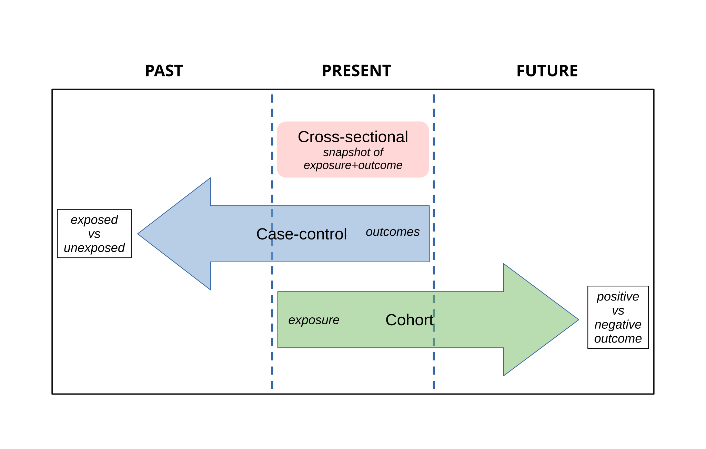

## From probability to data {.title-slide}

Week 3

Source of data and how to interpret them.

## What can 10 out of 100 tell us? {.motivation-slide .question-slide}

Opening hook

10 / 100

patients with hypersensitivity

?

population trait probability

Distribution?

What model describes the count?

Parameter?

What is the unknown quantity?

Best guess?

Where should the model live?

::: {.fragment .fade-up}

We observed data. Now the parameter is the unknown object.

:::

::: {.notes}
Let students answer verbally before revealing the binomial model. They should recall Week 2: a binary trait counted across fixed patients suggests a binomial model.

The intuitive estimate is 10/100 = 0.10, but the goal is to make that intuition feel principled rather than merely obvious.
:::

## Turn the question around {.concept-slide}

Probability and statistics use the same mathematics in opposite directions

Probability theory

model + parameter → possible data

↔

Statistics

observed data → plausible parameter/model

::: {.fragment .fade-up}

$$
X\sim \operatorname{Binomial}(100,p),\qquad X_{obs}=10
$$

:::

::: {.fragment .fade-up}

Statistics begins when we ask what the observations say about the data-generating process.

:::

::: {.notes}
Emphasize the direction of the question. In probability, p is known and X is uncertain. In statistics, X has been observed and p is uncertain.
:::

## Maximum likelihood laboratory {.exercise-slide}

Interactive parameter intuition

<label class="w3-control">Candidate trait probability p
<input id="mleP" type="range" min="0.01" max="0.30" value="0.05" step="0.001">
</label>

current p<strong id="mlePValue" class="probability">0.050</strong>

relative likelihood<strong id="mleLValue" class="estimate">—</strong>

<svg id="mleSvg" class="w3-svg dual" viewBox="0 0 900 360" aria-label="Interactive binomial likelihood explorer"></svg>

::: {.fragment .fade-up}

The parameter value that makes the observed data most compatible with the model has the highest likelihood.

:::

::: {.notes}
Have students move p until the highlighted likelihood dot reaches the top. The maximum should be near p=0.10.

Use the left panel to show probability of possible counts under a proposed p. Use the right panel to show likelihood as a function of p with the observed count fixed at 10.
:::

## Maximum likelihood in one sentence {.math-slide}

A general estimation principle

$$
\hat\theta_{\mathrm{MLE}}
=
\arg\max_\theta \mathcal{L}(\theta\mid x)
$$

::: {.fragment .fade-up}

Model family

e.g. binomial with fixed $n=100$

Observed data

$x=10$ hypersensitivity cases

Best-fitting parameter

$\hat p=10/100=0.10$

:::

::: {.fragment .fade-up}

Likelihood is not the probability that the parameter is true. It is a compatibility score for parameter values given the observed data.

:::

::: {.notes}
Use the definition but do not derive it. The priority is the inversion of the problem: p becomes the input to a function after data are observed.
:::

## Continuous data: likelihood uses density {.concept-slide}

Do not confuse density with point probability

<label class="w3-control">Candidate mean μ
<input id="likeMu" type="range" min="1.970" max="2.030" value="2.000" step="0.001">
</label>

observed tablet<strong class="observed">2.014 g</strong>

density at observation<strong id="likeDensity" class="estimate">—</strong>

<svg id="normalLikeSvg" class="w3-svg" viewBox="0 0 700 260" aria-label="Normal likelihood intuition"></svg>

::: {.fragment .fade-up}

$$
P(X=2.014)=0\quad\text{but}\quad \mathcal{L}(\mu\mid x)\propto f(x\mid\mu)
$$

:::

::: {.notes}
This is just a conceptual preview. Students do not need continuous likelihood theory yet. The point is that likelihood for continuous data comes from density values, not point probabilities.
:::

## The bridge so far {.concept-slide}

Opening synthesis

Probability models describe possible data

→

Data arrive from a study

→

Estimation asks which model parameters are plausible

→

Study design determines whether the answer is credible

::: {.fragment .fade-up}

Before analyzing data, ask how the data were generated.

:::

::: {.notes}
This slide pivots from likelihood to study design. The second half of the lecture is about how data can be trustworthy or misleading before any statistical test is performed.
:::

## Study design {.section-break}

Part II

How data are generated

We now see how reliable data generating processes are.

## Study-design tree {.concept-slide}

Was exposure or treatment assigned by the investigator?

  

  <!-- Level 1: Root -->
  

  
Study design

  

  <!-- Level 2: Primary Split -->
  

  
Observational

  
researcher observes exposure/outcome as they occur

  

  

  
Experimental

  
researcher assigns intervention or condition

  

  <!-- Level 3: Leaf Branches -->
  

  
Descriptive

  
describe frequency, distribution, case patterns

  

  

  
Analytical observational

  
cross-sectional · cohort · case-control

  

  

  
Clinical / interventional

  
control, randomization, blinding, endpoint definition

  

  <!-- Level 4: Goal Node -->
  

  
Design goal

  
make comparisons interpretable

  

  

::: {.notes}
The key first branch is assignment. If the investigator assigns exposure/treatment, it is experimental. Otherwise it is observational, even if the analysis is complex.
:::

## Three observational directions {.concept-slide}

For analytical observations: Direction of observation matters

  

  
Cross-sectional

  
measure exposure and outcome at one snapshot

  
exposure ↔ outcome

  

  

  
Cohort

  
classify by exposure, then follow outcomes

  
exposure → outcome

  

  

  
Case-control

  
start from outcome status, look backward for exposure

  
outcome → exposure history

  

  

  
  

::: {.notes}
Keep the examples pharmaceutical: drug exposure and adverse event; smoking and lung disease; genotype and hypersensitivity.
:::

## Experimental studies assign intervention {.concept-slide}

For clinical trials: Assignment is the defining move

Eligible patients

defined inclusion/exclusion criteria

→

Treatment assignment

ideally randomized

→

Endpoint measurement

predefined outcome

::: {.fragment .fade-up}

Clinical experiments try to make treatment groups comparable except for the intervention.

:::

::: {.notes}
Do not yet dive into p-values. The point is that experimental design creates the conditions under which a comparison may support causal interpretation.
:::

## Parallel and crossover trials {.concept-slide}

Two common clinical structures

Parallel design

randomize→Drug A→outcome

randomize→Drug B→outcome

Crossover design

Drug A→washout→Drug B

Drug B→washout→Drug A

::: {.fragment .fade-up}

Crossover studies can be efficient, but require attention to carryover and washout.

:::

::: {.notes}
Mention that crossover is not suitable when disease changes rapidly, treatment has lasting effects, or cure/outcome cannot be reset.
:::

## Clinical trial design levers {.concept-slide}

Small design choices can change interpretation

Comparator

placebo, standard therapy, dose group, active control

Randomization

protects against systematic allocation differences

Blinding

reduces expectation and observation effects

Endpoint

must be clinically meaningful and measurable

::: {.fragment .fade-up}

The data are only as interpretable as the comparison the design created.

:::

::: {.notes}
Mention double-dummy designs verbally: used when interventions look different, such as tablet versus injection, to preserve blinding.
:::

## Evidence depends on the question {.concept-slide}

A cautious hierarchy for causal treatment questions

Descriptive

what appears to be happening?

→

Observational analytical

associations under real-world conditions

→

Randomized comparative experiment

stronger protection against confounding

  
∑

  

  Meta-analysis &amp; Systematic Review
  Synthesizes and pools evidence across all available studies
  

::: {.fragment .fade-up}

Stronger design does not automatically mean better evidence: execution, relevance, measurement quality and bias still matter.

:::

::: {.notes}
Avoid teaching a rigid evidence pyramid. The best evidence depends on the question: efficacy, safety, rare adverse events, mechanism, diagnostic performance, or real-world utilization.
:::

## Correlation is not causation {.concept-slide}

A hidden common cause can structure the comparison

  <!-- SVG with natural aspect ratio preservation -->
  <svg class="causal-svg-overlay">
  <defs>
  <marker id="arrow-warning" viewBox="0 0 10 10" refX="7" refY="5" markerWidth="6" markerHeight="6" orient="auto">
  <path d="M 0 0 L 10 5 L 0 10 Z" fill="#d97706" />
  </marker>
  <marker id="arrow-grey" viewBox="0 0 10 10" refX="7" refY="5" markerWidth="6" markerHeight="6" orient="auto">
  <path d="M 0 0 L 10 5 L 0 10 Z" fill="#98a2b3" />
  </marker>
  </defs>
  <!-- Confounder Arrows (Top-center to bottom corners) -->
  <line x1="42%" y1="28%" x2="22%" y2="72%" stroke="#d97706" stroke-width="2" vector-effect="non-scaling-stroke" marker-end="url(#arrow-warning)" />
  <line x1="58%" y1="28%" x2="78%" y2="72%" stroke="#d97706" stroke-width="2" vector-effect="non-scaling-stroke" marker-end="url(#arrow-warning)" />
  <!-- Direct Causal Arrow (Bottom left to bottom right) -->
  <line x1="22%" y1="82%" x2="78%" y2="82%" stroke="#98a2b3" stroke-width="2" vector-effect="non-scaling-stroke" marker-end="url(#arrow-grey)" />
  </svg>
  <!-- Centered Grid Nodes -->
  
Disease severity

  
Drug choice

  
Outcome

::: {.fragment .fade-up}

If sicker patients are more likely to receive the strongest drug, crude outcomes can confuse treatment effect with baseline risk.

:::

::: {.notes}
Use the phrase confounding by indication: the reason a patient receives a treatment is itself related to prognosis.
:::

## Why randomization helps {.concept-slide}

Not magic, but a powerful design principle

Without randomization

clinician choice, patient preference, disease severity and access can all influence treatment group membership

With randomization

treatment assignment is independent of baseline characteristics in expectation

::: {.fragment .fade-up}

$$
\text{randomization} \;
\not\Rightarrow\; \text{identical groups}
$$

:::

::: {.fragment .fade-up}

Randomization protects against systematic confounding; chance imbalance can still occur.

:::

::: {.notes}
This corrects the common misconception that randomization guarantees balanced groups in a particular trial. It balances on average over repeated randomizations.
:::

## Observational causal reasoning {.concept-slide}

Bradford Hill considerations help structure judgment

Temporality

cause precedes effect

Dose-response

stronger exposure, stronger effect?

Plausibility

compatible with biological mechanism?

Consistency

seen across settings and methods?

::: {.fragment .fade-up}

These are considerations, not a checklist that proves causality.

:::

::: {.notes}
Mention confounding control as an analytic requirement: stratification, matching, regression adjustment, propensity scores later if relevant. Keep this introductory.
:::

## Stratification can reveal the hidden structure {.concept-slide}

Simpson's paradox: Compare like with like

  
Treatment

  
Lower-risk

  
Higher-risk

  
Overall

  
Drug A success rate

  
81/87 = 93%

  
192/263 = 73%

  
273/350 = 78%

  
Drug B success rate

  
234/270 = 87%

  
55/80 = 69%

  
289/350 = 83%

::: {.fragment .fade-up}

Within both risk strata, A looks better. In the aggregate, B looks better.

:::

<strong>The same reversal can occur with continuous variables.</strong>
Positive association within every subgroup, but negative association after aggregation.

<svg
  class="simpson-continuous-svg"
  viewBox="0 0 500 220"
  preserveAspectRatio="xMidYMid meet"
  aria-label="Continuous Simpson's paradox">
<!-- axes -->
<line x1="45" y1="180" x2="470" y2="180" class="simpson-axis"/>
<line x1="45" y1="20" x2="45" y2="180" class="simpson-axis"/>
<text x="260" y="210" text-anchor="middle" class="simpson-axis-title">
Predictor X
</text>
<text
  x="16"
  y="100"
  text-anchor="middle"
  class="simpson-axis-title"
  transform="rotate(-90 16 100)">
Response Y
</text>
<!-- overall negative trend -->
<line
  x1="70"
  y1="55"
  x2="425"
  y2="138"
  class="simpson-overall-line"/>
<!-- subgroup 1 -->
<g class="simpson-group simpson-group-1">
<circle cx="80" cy="80" r="5"/>
<circle cx="110" cy="65" r="5"/>
<circle cx="140" cy="50" r="5"/>
<line
  x1="70"
  y1="85"
  x2="150"
  y2="45"
  class="simpson-group-line"/>
<text x="108" y="36" text-anchor="middle" class="simpson-group-label">
Stratum 1
</text>
</g>
<!-- subgroup 2 -->
<g class="simpson-group simpson-group-2">
<circle cx="210" cy="110" r="5"/>
<circle cx="240" cy="95" r="5"/>
<circle cx="270" cy="80" r="5"/>
<line
  x1="200"
  y1="115"
  x2="280"
  y2="75"
  class="simpson-group-line"/>
<text x="240" y="68" text-anchor="middle" class="simpson-group-label">
Stratum 2
</text>
</g>
<!-- subgroup 3 -->
<g class="simpson-group simpson-group-3">
<circle cx="340" cy="140" r="5"/>
<circle cx="370" cy="125" r="5"/>
<circle cx="400" cy="110" r="5"/>
<line
  x1="330"
  y1="145"
  x2="410"
  y2="105"
  class="simpson-group-line"/>
<text x="372" y="98" text-anchor="middle" class="simpson-group-label">
Stratum 3
</text>
</g>
<!-- direction annotations -->
<text
  x="87"
  y="164"
  class="simpson-within-label">
within strata: positive
</text>
<text
  x="325"
  y="40"
  class="simpson-pooled-note">
pooled: negative
</text>
</svg>

::: {.fragment .fade-up}

Aggregation can hide the variable that structures the comparison.

:::

::: {.notes}
This is a Simpson's paradox example. Focus on the reversal: the group composition differs. Treatment A contains more high-risk patients overall.
:::

## Bias can enter at several stages {.concept-slide}

A lifecycle view of bias

1

Who enters?

selection · survivorship

2

What is measured?

calibration · device bias

3

How do people respond?

recall · social desirability · Hawthorne

4

How is it recorded?

rounding · input errors · default choices

5

What gets reported?

publication · selective reporting

::: {.fragment .fade-up}

Bias is not one thing. It is a family of systematic ways the data can become distorted.

:::

::: {.notes}
Connect each category to pharmacy examples: poorly calibrated balances, patient recall of OTC medications, selection into studies, default questionnaire choices, publication of positive results.
:::

## A practical bias taxonomy {.concept-slide}

Categorize before memorizing names

Selection
<ul><li>selection bias</li><li>survivorship bias</li></ul>

Measurement / recording
<ul><li>device calibration</li><li>observer bias</li><li>rounding and input errors</li></ul>

Participant / response
<ul><li>white-coat effect</li><li>Hawthorne effect</li><li>recall bias</li><li>social desirability</li><li>extreme / middle / default response styles</li></ul>

Reporting
<ul><li>publication bias</li><li>selective reporting</li><li>expectancy-driven emphasis</li></ul>

::: {.notes}
White-coat and Hawthorne are related to observation context but not identical. White-coat can be a physiological response; Hawthorne is behavior change due to being observed.
:::

## Spot the bias {.checkpoint-slide}

Prediction checkpoint

A blood-pressure device systematically reads 8 mmHg too high. Where did the bias enter?

<button class="mcq-option" data-choice="A">Selection</button>
<button class="mcq-option" data-choice="B">Measurement / device</button>
<button class="mcq-option" data-choice="C">Publication</button>
<button class="mcq-option" data-choice="D">Social desirability</button>

Correct: this is a measurement problem. The device produces systematically displaced observations.

::: {.notes}
Use this to make students practice categorization rather than memorization. The interaction works in the rendered HTML output.
:::

## Design of Experiments {.section-break}

Part III

How to plan an experiment

We now see the different ways experiments can be setup for the same question.

## Experimental design asks what to run {.concept-slide}

Factors, levels, response

Factor

an experimental input we deliberately vary

temperature

Level

a chosen setting of a factor

40°C vs 60°C

Response

the measured outcome

dissolution rate

::: {.fragment .fade-up}

Design of experiments asks which combinations of factor levels give interpretable information efficiently.

:::

::: {.notes}
Use a pharmaceutical technology example: mixing time, compression force, excipient concentration, drying temperature.
:::

## Full factorial design {.concept-slide}

Run every combination

low  temp · short  mix

high  temp · short  mix

low  temp · long  mix

high  temp · long  mix

::: {.fragment .fade-up}

Full factorial designs estimate main effects and interactions, but the number of runs grows quickly.

:::

::: {.notes}
Use this as a conceptual design pattern, not a full DOE course. Main effect: changing one factor. Interaction: the effect of one factor depends on another.
:::

## Latin square design {.concept-slide}

Blocking two nuisance sources of variation simultaneously

  <table class="latin-square-table">
  <thead>
  <tr>
  <th class="corner-header">
  Mix time ↓
  Temp →
  </th>
  <th>Low Temp</th>
  <th>Medium Temp</th>
  <th>High Temp</th>
  </tr>
  </thead>
  <tbody>
  <tr>
  <th class="row-title">Short mix</th>
  <td>Drug A</td>
  <td>Drug B</td>
  <td>Drug C</td>
  </tr>
  <tr>
  <th class="row-title">Medium mix</th>
  <td>Drug B</td>
  <td>Drug C</td>
  <td>Drug A</td>
  </tr>
  <tr>
  <th class="row-title">Long mix</th>
  <td>Drug C</td>
  <td>Drug A</td>
  <td>Drug B</td>
  </tr>
  </tbody>
  </table>

::: {.fragment .fade-up}

Each drug appears exactly once in every row (mix duration) and column (temperature level).

:::

::: {.notes}
Rows and columns can represent nuisance dimensions such as day and operator, position and batch, or sequence and period.
:::

## Robust design and Taguchi thinking {.concept-slide}

Good performance under unavoidable noise

Controllable factors

formulation, process settings, excipient ratio

→

Product response

dissolution, stability, assay value

::: {.fragment .fade-up}

Noise factors still act: humidity, raw-material variation, storage conditions, operator differences.

:::

::: {.fragment .fade-up}

Robust design seeks settings whose performance changes little under noise.

:::

::: {.notes}
Mention Taguchi as an engineering philosophy for robust design. Do not teach orthogonal arrays in detail here.
:::

## Bias and variability are different failures {.concept-slide}

Systematic displacement versus scatter

$$
\text{error}\;=\;\text{systematic component}\; + \;\text{random component}
$$

Bias

systematic displacement from the truth or target

Variance / imprecision

scatter of repeated observations around their average

::: {.fragment .fade-up}

A measurement system can be repeatable and still be systematically wrong.

:::

::: {.notes}
Connect to tablet mass, assay calibration, dissolution testing. Repeatability is consistency; accuracy needs closeness to truth.
:::

## Accuracy × precision {.concept-slide}

Four measurement patterns

low bias · low variance
<svg viewBox="0 0 160 120"><circle cx="80" cy="60" r="42" fill="none" stroke="#d9e1ea"/><circle cx="80" cy="60" r="22" fill="none" stroke="#d9e1ea"/><line x1="80" y1="15" x2="80" y2="105" stroke="#c65d09"/><line x1="35" y1="60" x2="125" y2="60" stroke="#c65d09"/><circle cx="78" cy="61" r="4" fill="#1f6feb"/><circle cx="83" cy="57" r="4" fill="#1f6feb"/><circle cx="75" cy="55" r="4" fill="#1f6feb"/></svg>

high bias · low variance
<svg viewBox="0 0 160 120"><circle cx="80" cy="60" r="42" fill="none" stroke="#d9e1ea"/><circle cx="80" cy="60" r="22" fill="none" stroke="#d9e1ea"/><line x1="80" y1="15" x2="80" y2="105" stroke="#c65d09"/><line x1="35" y1="60" x2="125" y2="60" stroke="#c65d09"/><circle cx="112" cy="34" r="4" fill="#1f6feb"/><circle cx="118" cy="38" r="4" fill="#1f6feb"/><circle cx="110" cy="42" r="4" fill="#1f6feb"/></svg>

low bias · high variance
<svg viewBox="0 0 160 120"><circle cx="80" cy="60" r="42" fill="none" stroke="#d9e1ea"/><circle cx="80" cy="60" r="22" fill="none" stroke="#d9e1ea"/><line x1="80" y1="15" x2="80" y2="105" stroke="#c65d09"/><line x1="35" y1="60" x2="125" y2="60" stroke="#c65d09"/><circle cx="52" cy="44" r="4" fill="#1f6feb"/><circle cx="106" cy="83" r="4" fill="#1f6feb"/><circle cx="75" cy="23" r="4" fill="#1f6feb"/><circle cx="92" cy="61" r="4" fill="#1f6feb"/></svg>

high bias · high variance
<svg viewBox="0 0 160 120"><circle cx="80" cy="60" r="42" fill="none" stroke="#d9e1ea"/><circle cx="80" cy="60" r="22" fill="none" stroke="#d9e1ea"/><line x1="80" y1="15" x2="80" y2="105" stroke="#c65d09"/><line x1="35" y1="60" x2="125" y2="60" stroke="#c65d09"/><circle cx="116" cy="25" r="4" fill="#1f6feb"/><circle cx="132" cy="68" r="4" fill="#1f6feb"/><circle cx="96" cy="35" r="4" fill="#1f6feb"/><circle cx="125" cy="93" r="4" fill="#1f6feb"/></svg>

::: {.fragment .fade-up}

Beyond Bias & Variance: Key Related Measurement Concepts

:::

  <!-- Card 1: Association & Concordance -->
  

  

  🎯
  <h4>Agreement & Alignment</h4>
  

  

  
<strong>Association:</strong> Asks if measurements are informative about a benchmark. A perfect monotonic relationship can exist even with massive systematic bias.

  
<strong>Consensus / Concordance:</strong> Asks if two datasets coincide directly (either exactly or within tolerance)—i.e., whether <em>overall total error</em> is low.

  
<strong>Interchangeability:</strong> Asks if measurement differences are small enough that two quantitative methods can replace one another in practice.

  

  

  <!-- Card 2: The 'R' Metrics -->
  

  

  🔄
  <h4>The "R" Metrics (Variability-Focused)</h4>
  

  

  
These address variability under varying conditions—<strong>saying nothing about bias</strong>.

  <ul>
  <li><strong>Reliability / Repeatability:</strong> Same operator, same instrument, same objects under identical conditions.</li>
  <li><strong>Replicability & Reproducibility:</strong> Relaxes strict constraints by introducing different objects or operators.</li>
  <li><strong>Robustness:</strong> Resistance when a justifiably similar but distinct method/instrument is used.</li>
  <li><strong>Ruggedness:</strong> Resistance of measurement precision to minor, unguided environmental fluctuations.</li>
  </ul>
  

  

::: {.notes}
Use the target as a visual metaphor. The orange crosshair is truth/target. Blue dots are repeated measurements. Students usually grasp accuracy/precision quickly through this image.
:::

## Bias–variance decomposition {.math-slide}

A compact error accounting identity

$$
\operatorname{MSE}(\hat\theta)
=
\operatorname{Bias}(\hat\theta)^2
+
\operatorname{Var}(\hat\theta)
$$

::: {.fragment .fade-up}

MSE

overall average squared error

Bias²

systematically wrong

Variance

unstable across repetitions

:::

::: {.fragment .fade-up}

Overall estimation error can arise from being systematically wrong, unstable, or both.

:::

::: {.notes}
This is the only formal math needed here. It prepares students for later discussions of modeling, prediction, overfitting and machine learning.
:::

## Summary statistics {.section-break}

Part IV

The first ingredient to descriptive statistics

We now see what numbers summarize the data in a clear interpretive way.

## One dataset, many summaries {.concept-slide}

If you may report only two numbers, which two?

median

mean

::: {.fragment .fade-up}

A summary statistic compresses data. Compression always loses some information.

:::

::: {.notes}
The red observation is an outlier. The mean shifts toward it; the median is more stable. Use this to motivate robust summaries.
:::

## Mean, median, mode {.concept-slide}

Different answers to “where is the center?”

Mean

$\bar x=\frac1n\sum x_i$

balance point; sensitive to extreme values

Median

middle ordered value

half the data below, half above; robust to outliers

Mode

most frequent value

especially natural for categorical or discrete data

::: {.fragment .fade-up}

  <table class="sample-compare-table">
  <thead>
  <tr>
  <th>Sample A</th>
  <th>Sample B (with outlier)</th>
  </tr>
  </thead>
  <tbody>
  <tr class="sample-values">
  <td>$8, 8, 10, 11, 12$</td>
  <td>$8, 8, 10, 11, 80$</td>
  </tr>
  <tr class="sample-stats">
  <td>
  <strong>Mean:</strong> $9.8$
  <strong>Median:</strong> $10$
  <strong>Mode:</strong> $8$
  </td>
  <td>
  <strong>Mean:</strong> $23.4$
  <strong>Median:</strong> $10$
  <strong>Mode:</strong> $8$
  </td>
  </tr>
  </tbody>
  </table>

:::

::: {.fragment .fade-up}

The mean moves. The median barely does.

:::

::: {.notes}
Use the example verbally: mean changes from 10 to 23.6; median remains 10. This is a nice quick mental arithmetic exercise.
:::

## Arithmetic, weighted and geometric means {.concept-slide}

Three ways to average, three different meanings

Arithmetic mean

$\bar x=\frac1n\sum x_i$

ordinary average for additive measurements

Weighted mean

$\bar x_w=\frac{\sum w_i x_i}{\sum w_i}$

batch means should account for batch size

Geometric mean

$G=\exp\left(\frac1n\sum\log x_i\right)$

useful for positive multiplicative quantities

::: {.fragment .fade-up}

On the log scale, multiplication becomes addition.

:::

::: {.notes}
Pharmaceutical examples: exposure measures, concentration ratios, fold changes, log-normal pharmacokinetic variables such as AUC or Cmax.
:::

## Variance and standard deviation {.math-slide}

Quantifying scatter around the mean

$$
\text{var}=s^2=\frac{1}{n-1}\sum_{i=1}^n(x_i-\bar x)^2$$

::: {.fragment .fade-up}

Variance

average squared deviation; units are squared

Standard deviation

square root of variance; returns to original units

:::

::: {.fragment .fade-up}

The sample variance uses $n-1$; we will return to why later.

:::

::: {.notes}
Don't overteach degrees of freedom here. They will revisit sampling distributions and inference later.
:::

## Robust spread: IQR and MAD {.concept-slide}

When outliers or skewness matter

  

  
Interquartile range

  
$IQR=Q_3-Q_1$

  
width of the middle 50% of the data

  

  <svg
    id="iqrMiniSvg"
    class="summary-mini-svg"
    viewBox="0 0 320 150"
    preserveAspectRatio="xMidYMid meet"
    aria-label="Normal density with the interquartile range highlighted">
  </svg>
  

  

  

  
Median absolute deviation

  
$MAD=\operatorname{median}\{|x_i-\operatorname{median}(x)|\}$

  
typical absolute distance from the median

  

  <svg
    id="madMiniSvg"
    class="summary-mini-svg"
    viewBox="0 0 320 150"
    preserveAspectRatio="xMidYMid meet"
    aria-label="Observations and their absolute deviations from the median">
  </svg>
  

  

::: {.fragment .fade-up}

Median + IQR/MAD is often more stable when data are skewed or contaminated by extreme observations.

:::

::: {.notes}
Use the same outlier example from mean/median. Don't make this a computational lecture; make it a reporting-choice lecture.
:::

## Which summary fits the shape? {.checkpoint-slide}

Choose a center and a spread

A positive assay measure is strongly right-skewed with a few extreme high values. Which summary pair is usually more stable for a typical value?

<button class="mcq-option" data-choice="A">mean + standard deviation</button>
<button class="mcq-option" data-choice="B">mode + variance</button>
<button class="mcq-option" data-choice="C">median + IQR or MAD</button>
<button class="mcq-option" data-choice="D">minimum + maximum only</button>

Correct: skewness and extreme values often motivate robust summaries such as the median and IQR/MAD.

::: {.notes}
Frame this as a rule of thumb, not an absolute law. Reporting depends on scientific context, audience, and convention.
:::

## Quick check: MLE {.checkpoint-slide}

Prediction exercise

24 hypersensitivity reactions are observed among 200 treated patients. Where should the binomial likelihood peak?

<button class="mcq-option" data-choice="A">0.024</button>
<button class="mcq-option" data-choice="B">0.12</button>
<button class="mcq-option" data-choice="C">0.24</button>
<button class="mcq-option" data-choice="D">1.20</button>

Correct: the binomial maximum-likelihood estimate is $\hat p=k/n=24/200=0.12$.

::: {.notes}
This retrieves the opening idea. Students should be able to answer this without calculation beyond division.
:::

## Quick check: study design {.checkpoint-slide}

Prediction exercise

Patients are classified by current drug exposure and blood pressure is measured today. No treatment is assigned. What design is this?

<button class="mcq-option" data-choice="A">randomized clinical trial</button>
<button class="mcq-option" data-choice="B">crossover trial</button>
<button class="mcq-option" data-choice="C">cross-sectional observational study</button>
<button class="mcq-option" data-choice="D">Latin square experiment</button>

Correct: exposure and outcome are measured at one time point, and the investigator did not assign treatment.

::: {.notes}
Reinforce: no assignment means observational, regardless of how many variables are measured.
:::

## Quick check: confounding {.checkpoint-slide}

Prediction exercise

Patients receiving the strongest drug also have the most severe disease. Outcomes are worse in that group. What should you worry about first?

<button class="mcq-option" data-choice="A">confounding by disease severity</button>
<button class="mcq-option" data-choice="B">Poisson variation</button>
<button class="mcq-option" data-choice="C">geometric waiting time</button>
<button class="mcq-option" data-choice="D">Dirac delta behavior</button>

Correct: the apparent treatment-outcome association may reflect baseline severity rather than a causal drug effect.

::: {.notes}
This retrieves the causal diagram and confounding by indication.
:::

## Quick check: robust center {.checkpoint-slide}

Prediction exercise

For the data $5.1, 5.2, 5.2, 5.3, 19.8$, which center best represents the typical observation?

<button class="mcq-option" data-choice="A">arithmetic mean</button>
<button class="mcq-option" data-choice="B">median</button>
<button class="mcq-option" data-choice="C">maximum</button>
<button class="mcq-option" data-choice="D">variance</button>

Correct: the median is resistant to the extreme high value and remains close to the main cluster.

::: {.notes}
This prepares students for Week 4 visualization and data inspection.
:::

## What did this bridge week do? {.concept-slide}

Week 3 synthesis

Probability model

→

Observed data

→

Study design determines credibility

→

Summaries describe what happened

::: {.fragment .fade-up}

We now know why and how data are generated. Next week we start working with data as objects.

:::

::: {.notes}
Close the loop to Week 1/2: probability models describe uncertain processes; data are generated through studies; statistics uses data to learn about the process, but only if design and measurement are credible.
:::

