## Understanding data {.title-slide}

Week 4

From recorded values to usable information.

::: {.notes}
This week is a data-literacy pivot. Students now assume that a study has produced observations; the lecture asks how values become usable information, how data are structured and cleaned, and how visualization guides exploratory analysis.
:::

## From last week to this week {.concept-slide}

Retrieval

Study design

how observations are generated

→

Data

recorded observations

→

Decisions

only as credible as the data-generating process

::: {.fragment .fade-up}

Careful planning creates data we can trust. Now we ask how to understand those data.

:::

## Now we have the data. Where do we start? {.motivation-slide}

Opening hook

21242631485255
41387276806358
5198103110877970
65605789939678

::: {.fragment .fade-up}

What do these numbers suggest?

:::

::: {.fragment .fade-up}

Raw numbers rarely tell their story by themselves.

:::

## Humans see patterns before they calculate them {.concept-slide}

Exploratory analysis starts visually

<svg id="outbreakSvg" viewBox="0 0 700 360" aria-label="Synthetic infection counts"></svg>

::: {.fragment .fade-up}

Before formal analysis, inspect the shape of the data.

:::

::: {.fragment .fade-up}

Synthetic teaching example: the graphic illustrates statistical reasoning, not a claim about any real pandemic policy or intervention.

:::

## Visual pattern → hypothesis → evidence {.concept-slide}

A bridge back to causality: Pattern recognition is the beginning, not the conclusion

Visual pattern

something appears structured

→

Hypothesis

a possible explanation

→

Evidence

study design + analysis test the explanation

::: {.fragment .fade-up}

Visualization can generate questions. It does not, by itself, prove causes.

:::

## Data are recorded values {.concept-slide}

Without context, values are disconnected from the world

37.8

value only

120

value only

F

symbol only

Stage 2

label only

::: {.fragment .fade-up}

A number becomes useful only when we know what it represents.

:::

## Context turns data into information {.concept-slide}

Same values, now connected to meaning

37.8 °C

body temperature

120 mmHg

systolic blood pressure

F

sex variable

Stage 2

disease stage

::: {.fragment .fade-up}

Information is data interpreted in context.

:::

## Data, information, knowledge {.concept-slide}

Three levels of use

Data

recorded values, symbols or measurements

→

Information

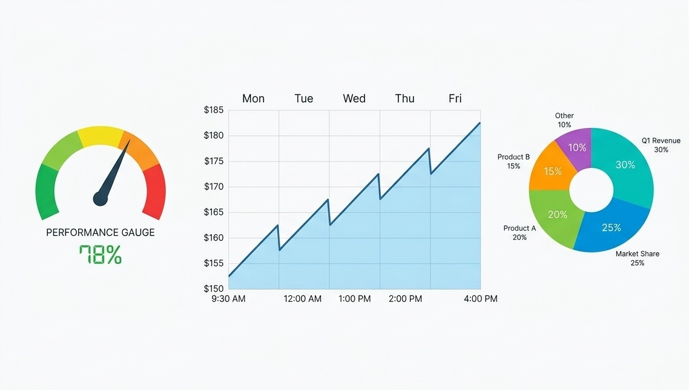

data plus context and meaning

→

Knowledge

information connected, interpreted and used

::: {.fragment .fade-up}

Statistics helps us move from recorded values toward usable knowledge.

:::

## Information as surprise {.math-slide}

A short information-theory side-track

$$
I(x)=-\log_2 \mathbb{P}(x)
$$

$P(x)=1$

0 bits

$P(x)=1/2$

1 bit

$P(x)=1/8$

3 bits

::: {.fragment .fade-up}

Rare events are more surprising, so observing them carries more information.

:::

## Try it: probability and surprise {.exercise-slide}

Interactive concept slide

<label class="w4-control">Event probability p<input id="surpriseP" type="range" min="0.01" max="1" value="0.50" step="0.01"></label>

probability <strong id="surprisePValue">0.50</strong>

surprise <strong id="surpriseBits">1.00 bits</strong>

::: {.fragment .fade-up}

As probability goes down, surprise goes up.

:::

## Entropy is expected surprise {.math-slide}

Average information content

$$
H(X)=-\sum_i \mathbb{P}(x_i)\log_2 \mathbb{P}(x_i)
$$

Predictable source

AAAAAAAAABAAAAAA

low entropy

Less predictable source

ABBAABAABBABBAAB

higher entropy

## Entropy and randomness {.concept-slide}

Shared mathematics across information and physical states

Shannon entropy

uncertainty over possible messages or symbols

high entropy → hard to predict

Statistical-mechanical entropy

uncertainty over possible microstates

shared mathematical structure

::: {.fragment .fade-up}

Both quantify uncertainty over possible states.

:::

  

  
Claude Elwood Shannon

  
  

## Types of variables {.section-break}

Part II

Types of variables

We now see the different data types and their characteristics.

## First question: what kind of variable is it? {.concept-slide}

Data types determine meaningful summaries and plots

Categorical

<strong>Nominal</strong> names, no order

<strong>Ordinal</strong> ordered categories

Numerical

<strong>Interval</strong> differences meaningful

<strong>Ratio</strong> ratios meaningful

::: {.fragment .fade-up}

The data type tells us what operations make sense.

:::

## Nominal and ordinal examples {.concept-slide}

Categorical variables

Nominal

formulation type · sex · genotype · adverse-event category

no intrinsic order

Ordinal

disease stage · toxicity grade · response category · pain scale

ordered categories

::: {.fragment .fade-up}

Nominal categories of "A", "B", "0" blood group have no inherent order or distance.

:::

::: {.fragment .fade-up}

Ordinal categories of "severe", "normal", "moderate" still have no inherent distance (difference and sum are not meaningful), but there is inherent order.

:::

## Interval and ratio examples {.concept-slide}

Numerical variables

Interval

temperature in °C · calendar year

differences meaningful

Ratio

mass · concentration · dose · time · Kelvin temperature

differences and ratios meaningful

absolute zero exists

::: {.fragment .fade-up}

A temperature of 20 °C is not “twice as hot” as 10 °C; a 20 mg dose is twice a 10 mg dose.

:::

::: {.fragment .fade-up}

Note how Celsius scale has no absolute zero point (it can be positive and negative), while Kelvin has an absolute zero.

:::

::: {.fragment .fade-up}

But not every value that can be negative is automatically interval: for electric charge the negative does not signify magnitude, but rather direction, so it is still ratio.

:::

## Which summaries make sense? {.concept-slide}

A bridge back to Week 3

Variable type

Frequency

Mode

Median

Mean

Nominal

✓

✓

—

—

Ordinal

✓

✓

✓

usually no

Numerical

✓

✓

✓

✓

## Try it: classify the variable {.exercise-slide}

Interactive data-type checkpoint

blood group

<button data-answer="nominal">Nominal</button>
<button data-answer="ordinal">Ordinal</button>
<button data-answer="interval">Interval</button>
<button data-answer="ratio">Ratio</button>

Choose the best type.

## Data structure {.section-break}

Part III

Data structure

We now see how data should be structured.

## Structured and unstructured data {.concept-slide}

This course mostly uses structured tabular data

  <!-- Structured Box -->
  

  
Structured

  

  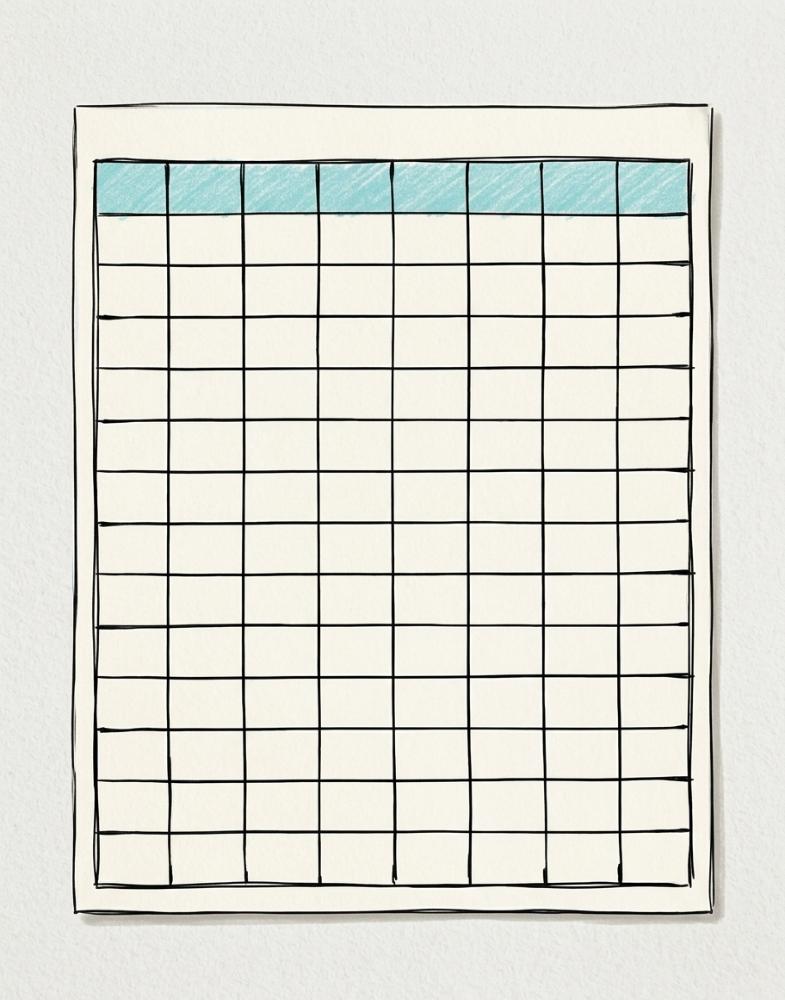
  

  

  
patient table

  
laboratory results table

  
clinical-trial spreadsheet

  

  

  <!-- Unstructured Box -->
  

  
Unstructured

  

  
  

  

  
free-text clinical note

  
image

  
audio / scanned report

  

  

## Anatomy of a data table {.concept-slide}

Rows, columns and cells

patientID

sex

stage

diabetes

weight_kg

height_cm

bp_mmHg

bodyT_C

P01

F

1

false

58

164

118

36.8

P02

M

2

false

82

180

142

37.1

P03

F

3

true

72

169

155

38.0

::: {.fragment .fade-up}

Rows are observations; columns are variables; cells are values.

:::

::: {.fragment .fade-up}

We will reuse this type of structure throughout Week 4.

:::

## Wide format → Long format {.concept-slide}

Humans often like reading repeated measurements side-by-side → Long format often makes grouping and plotting easier

patient

day1

day2

day3

P01

120

124

122

P02

142

139

137

→

patient

day

bp_mmHg

P01

1

120

P01

2

124

P01

3

122

P02

1

142

P02

2

139

P02

3

137

::: {.fragment .fade-up}

Wide format keeps multiple measurement occasions in separate columns.

:::

## Transformation creates derived variables {.concept-slide}

Raw variables can create new variables

weight = 72 kg

height = 1.78 m

→

BMI = 22.7

$$
BMI=\frac{\mathrm{weight}_{kg}}{\mathrm{height}_m^2}
$$

## Transformation changes representation {.concept-slide}

The patient does not change; the data representation changes

Units

kg → g

Temperature scale

°C → K

Log scale

concentration → log concentration

Derived variable

weight + height → BMI

## Why log-transform? {.concept-slide}

Multiplicative variation can become additive structure

Raw scale

1101001000

log10 scale

0123

## Missing values are not just empty cells {.concept-slide}

Missingness has causes

patient

visit

bp_mmHg

temp_C

reason?

P01

1

118

36.8

observed

P01

2

NA

37.0

?

P02

1

142

NA

?

  
measurement failed

  
patient skipped visit

  
not applicable

  
data-entry loss

  
dropout

## Handling missing values {.concept-slide}

No method is automatically safe

  <!-- Card 1: Delete Rows -->
  

  
Delete rows

  

  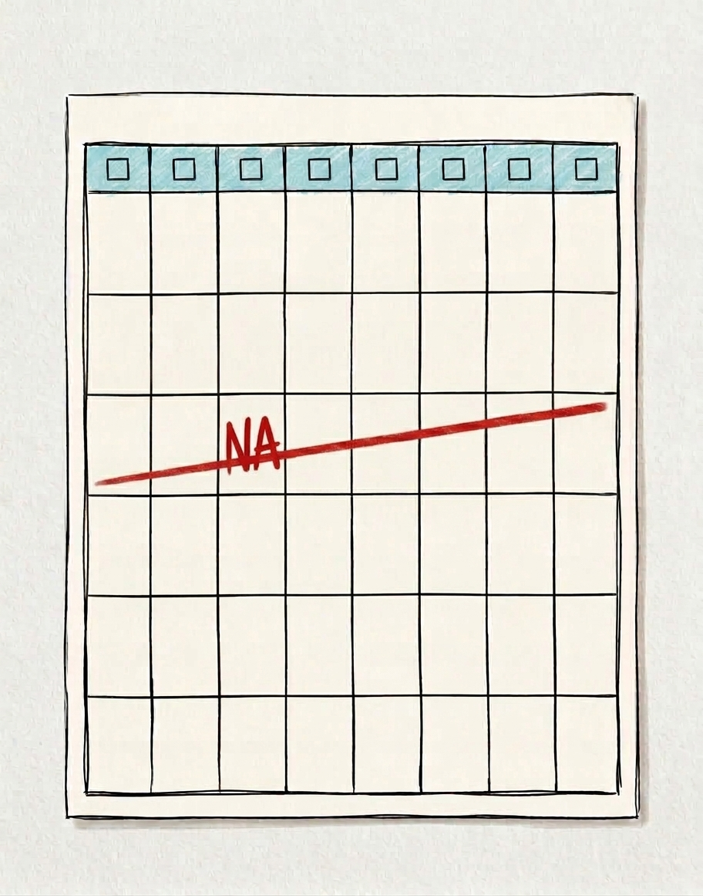
  

  
simple, but can discard information or bias results

  

  <!-- Card 2: Simple Imputation -->
  

  
Simple imputation

  

  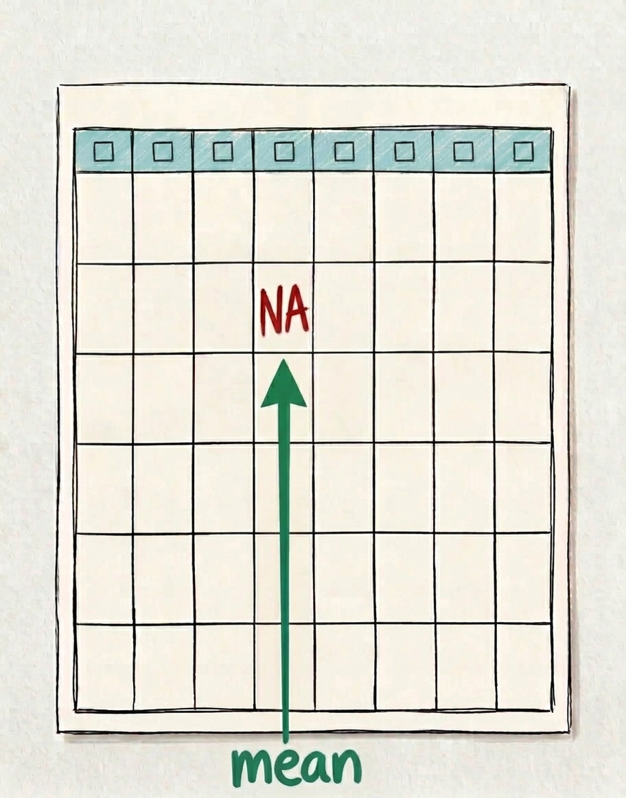
  

  
mean · median · mode

  

  <!-- Card 3: Model-based -->
  

  
Similarity/model-based

  

  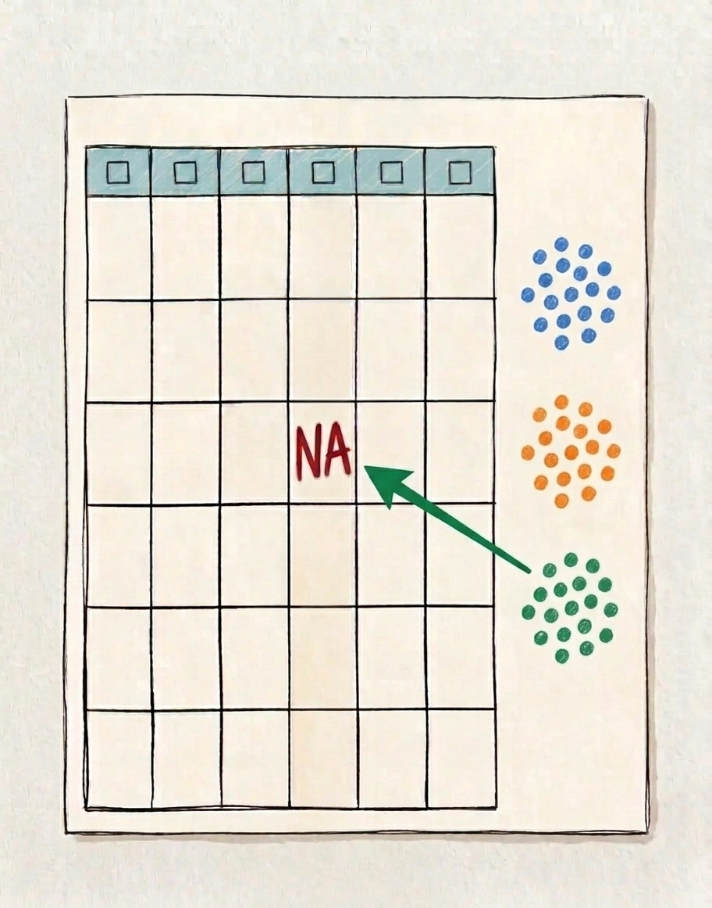
  

  
use related variables or similar records

  

  <!-- Card 4: Carry Forward -->
  

  
Carry forward

  

  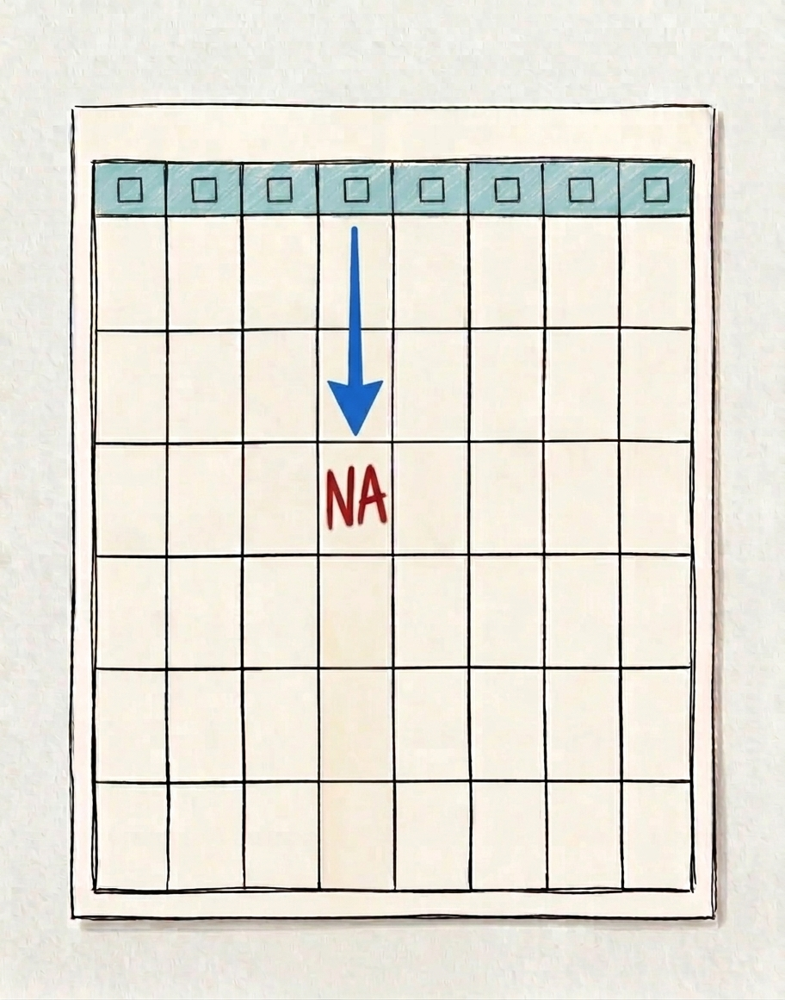
  

  
useful for time-series data

  

::: {.fragment .fade-up}

The reason values are missing matters as much as the replacement rule.

:::

## Tiny imputation demonstration {.concept-slide}

The chosen rule changes the inserted value

Observed series

5, 6, NA, 7, 20

Mean imputation

NA → 9.5

pulled by the outlier

Median imputation

NA → 6.5

more robust here

## Databases {.section-break}

Part IV

Databases

We now see how data is stored and retrieved from databases.

## Queries are set operations {.concept-slide}

Database logic returns to Week 1 set theory

  <!-- Left Side: Venn Diagram -->
  

  
A: diabetes

  
B: high BP

  

  <!-- Right Side Column: Stacked Cards -->
  

  

  
AND

  
$A\cap B$

  
patients satisfying both filters

  

  

  
OR

  
$A\cup B$

  
patients satisfying either filters

  

  

## Patient search dashboard {.exercise-slide}

Interactive data-query exercise

<label>diabetes<select id="qDiabetes"><option value="any">any</option><option value="true">true</option><option value="false">false</option></select></label>
<label>sex<select id="qSex"><option value="any">any</option><option value="F">F</option><option value="M">M</option></select></label>
<label>BP status<select id="qBpStatus"><option value="any">any</option><option value="low">low</option><option value="normal">normal</option><option value="high">high</option></select></label>
<label>stage<select id="qStage"><option value="any">any</option><option value="1">1</option><option value="2">2</option><option value="3">3</option></select></label>
<label>height ≥ <strong id="qHeightValue">150</strong> cm<input id="qHeight" type="range" min="150" max="190" value="150" step="1"></label>
<label>combine<select id="qLogic"><option value="and">AND</option><option value="or">OR</option></select></label>

matched<strong id="qCount">—</strong>patients

## Joining tables: left join {.concept-slide}

Attach matching information while keeping the left table

ID

sex

stage

P01

F

1

P02

M

2

P03

F

3

patients

ID

lab_value

P01

32

P03

51

labs

→

ID

sex

stage

lab_value

P01

F

1

32

P02

M

2

NA

P03

F

3

51

left join

## Joining tables: full join {.concept-slide}

Keep every record from both sides

ID

sex

stage

P01

F

1

P02

M

2

patients

ID

lab_value

P01

32

P03

51

labs

→

ID

sex

stage

lab_value

P01

F

1

32

P02

M

2

NA

P03

NA

NA

51

full join

## Graphs {.section-break}

Part V

The second ingredient to descriptive statistics

We now see how data are visualized.

## Visualization depends on variable types {.concept-slide}

Main concept of the week

Selection

Useful view

1 categorical

frequency table + bar plot

2 categorical

contingency table + stacked bar plot

1 numerical

summary + histogram + boxplot

2 numerical

scatter plot

categorical + numerical

grouped boxplot

Rule of thumb

First identify variable types, then choose the graphical encoding.

<!-- ## One categorical variable {.concept-slide} -->

<!-- 
Frequency table and bar plot
 -->

<!-- 
 -->
<!-- 

sex

count

F

9

M

9

 -->
<!-- 
<svg id="plotOneCat" viewBox="0 0 500 300"></svg>
 -->
<!-- 
 -->

<!-- ## Two categorical variables {.concept-slide} -->

<!-- 
Contingency table and stacked bar plot
 -->

<!-- 
 -->
<!-- 

sex

stage 1

stage 2

stage 3

F

3

3

3

M

3

3

3

 -->
<!-- 
<svg id="plotTwoCat" viewBox="0 0 500 300"></svg>
 -->
<!-- 
 -->

<!-- ## One numerical variable {.concept-slide} -->

<!-- 
Summary, histogram and boxplot
 -->

<!-- 
 -->
<!-- 

bp_mmHg

mean ≈ 135 · SD ≈ 17 · median ≈ 134 · IQR ≈ 28

 -->
<!-- 
<svg id="plotOneNum" viewBox="0 0 500 300"></svg>
 -->
<!-- 
 -->

<!-- ## Two numerical variables {.concept-slide} -->

<!-- 
Scatter plot and marginal distribution intuition
 -->

<!-- 
<svg id="plotTwoNum" viewBox="0 0 700 320"></svg>
 -->

<!-- ## One categorical + one numerical {.concept-slide} -->

<!-- 
Compare distributions across groups
 -->

<!-- 
<svg id="plotCatNum" viewBox="0 0 700 320"></svg>
 -->

<!-- ## Two categorical + one numerical {.concept-slide} -->

<!-- 
Facets and summary heatmaps
 -->

<!-- 
 -->
<!-- 
<svg id="plotTwoCatNumBox" viewBox="0 0 500 300"></svg>
 -->
<!-- 
<svg id="plotHeatmap" viewBox="0 0 500 300"></svg>
 -->
<!-- 
 -->

<!-- ## Two numerical variables plus categorical encodings {.concept-slide} -->

<!-- 
Color and shape carry categorical information
 -->

<!-- 
<svg id="plotEncodedScatter" viewBox="0 0 700 320"></svg>
 -->

## Try it: choose what to visualize {.exercise-slide}

Interactive visualization laboratory

<!-- 
 -->
<!-- 
 -->
<!-- <label><input type="checkbox" value="sex">sex</label> -->
<!-- <label><input type="checkbox" value="stage">disease_stage</label> -->
<!-- <label><input type="checkbox" value="bp">bp_mmHg</label> -->
<!-- <label><input type="checkbox" value="temp">bodyT_C</label> -->
<!-- 
 -->
<!-- 
 -->
<!-- 
Select one or more variables.
 -->
<!-- <svg id="vizLabSvg" viewBox="0 0 560 360" aria-label="Selected-variable visualization"></svg> -->
<!-- 
 -->
<!-- 
 -->

  

  <label><input type="checkbox" value="sex">sex</label>
  <label><input type="checkbox" value="stage">disease_stage</label>
  <label><input type="checkbox" value="bp">bp_mmHg</label>
  <label><input type="checkbox" value="temp">bodyT_C</label>
  

  

  

  Select one or more variables.
  

  

  
  

  

## The same data can tell different visual stories {.concept-slide}

Axis choices matter

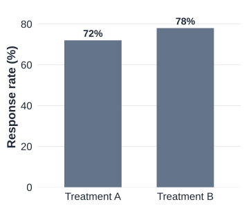

axis starts at 0

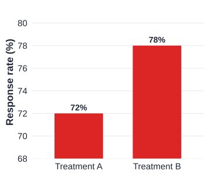

truncated y-axis exaggerates differences

<!-- ## Visualization is analysis, not decoration {.concept-slide} -->

<!-- 
Choose encodings that match the data and question
 -->

<!-- 
 -->
<!-- 

Too many pie slices

hard to compare 18 categories

 -->
<!-- 

Line plot for unordered categories

implies continuity or order that may not exist

 -->
<!-- 

3D bars

perspective distorts values

 -->
<!-- 
 -->

## Visualization is analysis, not decoration {.concept-slide}

Choose encodings that match the data and question

Too many pie slices

hard to compare 18 categories

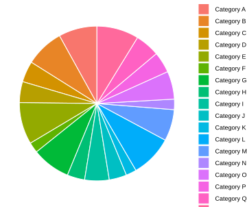

Line plot for unordered categories

implies continuity or order that may not exist

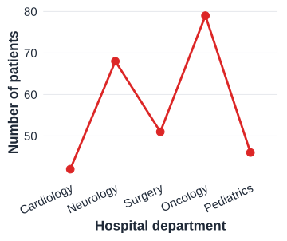

3D bars

perspective distorts values

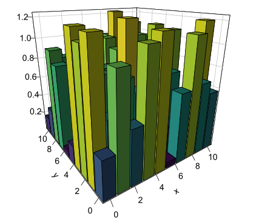

::: {.fragment .fade-up}

A plot is an analytical choice, not decoration.

:::

## Exercise: what data type is this? {.exercise-slide}

Disease stage I, II, III is best described as...

<button class="mc-button" data-correct="false">Nominal</button>
<button class="mc-button" data-correct="true">Ordinal</button>
<button class="mc-button" data-correct="false">Interval</button>
<button class="mc-button" data-correct="false">Ratio</button>

Choose an answer.

## Exercise: what should you plot? {.exercise-slide}

Compare systolic BP distributions between disease stages.

<button class="mc-button" data-correct="false">Pie chart</button>
<button class="mc-button" data-correct="false">Scatter plot only</button>
<button class="mc-button" data-correct="true">Grouped boxplot</button>
<button class="mc-button" data-correct="false">3D bar chart</button>

Choose an answer.

## Exercise: what does this query return? {.exercise-slide}

diabetes = TRUE AND BP = high returns...

<button class="mc-button" data-correct="true">only patients satisfying both conditions</button>
<button class="mc-button" data-correct="false">patients satisfying either condition</button>
<button class="mc-button" data-correct="false">all diabetic patients regardless of BP</button>
<button class="mc-button" data-correct="false">all high-BP patients regardless of diabetes</button>

Choose an answer.

## Exercise: what went wrong? {.exercise-slide}

Data cleaning checkpoint

patient

sex

stage

bp

temp

problem?

P01

F

1

118

36.8

—

P02

M

2

high

37.1

text in numeric column

P03

F

3

155

999

coded missing value

P03

F

3

155

38.0

duplicate patient

P04

M

1

126

24.0

impossible value?

## What did we learn? {.concept-slide}

Week 4 synthesis

Good data begin with a credible data-generating process.

Structure makes data usable: rows, columns, variables and values.

Cleaning and transformation change what later analysis can mean.

Visualization exposes shape, patterns and problems before formal inference.

::: {.fragment .fade-up}

Next week: why averages and distributions become predictable when samples grow.

:::

