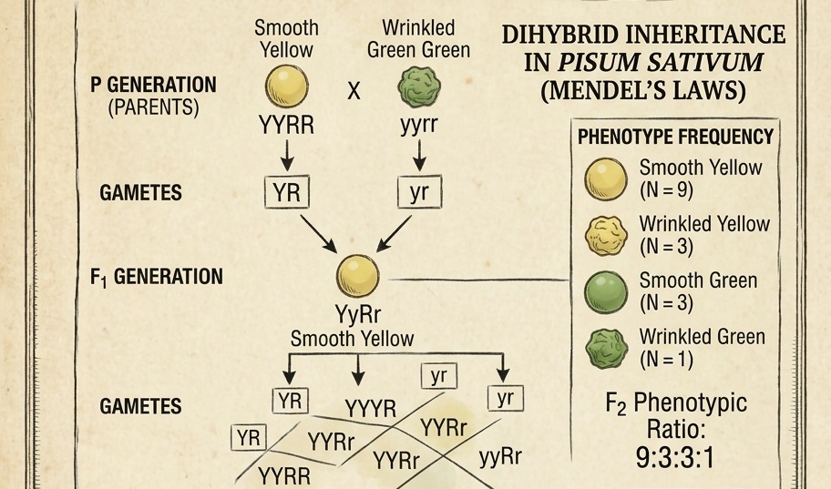

## Sampling distributions {.title-slide}

Week 5

How samples become predictable.

::: {.notes}
This week is deliberately shorter because of the midterm exam. The teaching goal is not to overload students, but to make sampling distributions, LLN and CLT feel inevitable after Weeks 1–4.
:::

## Wouldn't it be nice to observe the truth? {.motivation-slide}

Opening hook

  <!-- Truth -->
  

  truth $\theta$
  

  <!-- Sampling / noise prism -->
  

  <svg viewBox="0 0 220 170" class="prism-svg" aria-label="Truth filtered through sampling and noise">
  <defs>
  <linearGradient id="prismFill" x1="0" y1="0" x2="1" y2="1">
  <stop offset="0%" stop-color="rgba(123,74,181,0.16)"/>
  <stop offset="100%" stop-color="rgba(217,119,6,0.18)"/>
  </linearGradient>
  <linearGradient id="beamIn" x1="0" y1="0" x2="1" y2="0">
  <stop offset="0%" stop-color="rgba(16,24,40,0.10)"/>
  <stop offset="100%" stop-color="rgba(123,74,181,0.80)"/>
  </linearGradient>
  <linearGradient id="beamOut" x1="0" y1="0" x2="1" y2="0">
  <stop offset="0%" stop-color="rgba(123,74,181,0.85)"/>
  <stop offset="100%" stop-color="rgba(31,111,235,0.90)"/>
  </linearGradient>
  </defs>
  <!-- incoming beam -->
  <line x1="8" y1="85" x2="62" y2="85" class="truth-beam-in"/>
  <!-- prism body -->
  <polygon
  points="72,26 138,18 158,142 92,150"
  class="prism-body"/>
  <!-- prism highlight -->
  <line x1="88" y1="32" x2="104" y2="145" class="prism-shine"/>
  <!-- signal path inside prism -->
  <path
  d="M 62 85
  C 77 84, 88 82, 98 77
  S 118 69, 130 78
  S 145 92, 151 96"
  class="truth-beam-mid"/>
  <!-- faint possible outputs -->
  <path d="M 151 96 C 170 84, 184 74, 208 63" class="truth-beam-ghost"/>
  <path d="M 151 96 C 171 94, 188 96, 208 96" class="truth-beam-ghost"/>
  <path d="M 151 96 C 172 104, 188 117, 208 130" class="truth-beam-ghost"/>
  <!-- emphasized observed path -->
  <path d="M 151 96 C 171 94, 188 96, 208 96" class="truth-beam-out"/>
  <circle cx="208" cy="96" r="4.5" class="obs-dot"/>
  <!-- noise particles -->
  <circle cx="108" cy="56" r="2.3" class="noise-dot"/>
  <circle cx="122" cy="102" r="2.0" class="noise-dot"/>
  <circle cx="136" cy="62" r="1.8" class="noise-dot"/>
  <circle cx="112" cy="124" r="2.1" class="noise-dot"/>
  </svg>
  
sampling + noise

  

  <!-- Observation -->
  

  one observed statistic $\hat\theta$
  

::: {.fragment .fade-up}

Science usually gives us observations, not direct access to the population truth.

:::

## Measurement error was already bad enough {.concept-slide}

Recall from Week 3

$$
\text{observation}
=
\text{truth}
+
\text{systematic error}
+
\text{random error}
$$

Truth

what we wish to know

Bias

systematic displacement

Variance

random scatter

## But there is another source of uncertainty {.concept-slide}

Sampling error

population

→

sample statistic

::: {.fragment .fade-up}

Even if measurement were perfect, a sample is only part of the population.

:::

<strong>Population:</strong> the full set/process we want to learn about.

<strong>Sample:</strong> the subset of observations we actually collect.

## Why not measure everyone? {.concept-slide}

Feasibility and ethics

Cost

full measurement may be unrealistic

Time

evidence is needed before forever

Destructive tests

some measurements consume the sample

Ethics

avoid unnecessary exposure or risk

Infinite process

sometimes population means all possible outcomes

::: {.fragment .fade-up}

Good sampling lets us learn enough without measuring everything.

:::

## Population can be conceptual {.concept-slide}

Not always a literal list of people

Clinical population

patients who could receive a therapy

Manufacturing process

all tablets this process could produce

Idealized population

e.g., very large population assumption in Hardy–Weinberg reasoning

::: {.fragment .fade-up}

A population often means the data-generating process behind the observations.

:::

## A sample statistic changes from sample to sample {.concept-slide}

Same population, different samples

$\bar x_1=7.8$

$\bar x_2=8.4$

$\bar x_3=8.0$

::: {.fragment .fade-up}

A statistic is itself a random quantity before the sample is observed.

:::

## Sampling distribution {.math-slide}

The central object of Week 5

A <strong>sampling distribution</strong> is the distribution of a statistic across repeated samples from the same population.

population

→

sample 1

→

$\bar X_1$

sample 2

→

$\bar X_2$

sample 3

→

$\bar X_3$

⋮

⋮

## Two laws make repeated sampling well behaved {.concept-slide}

The big picture

Law of Large Numbers

Where does the estimate go?

running averages stabilize near the expectation

Central Limit Theorem

How does the estimate vary?

sample means acquire a predictable shape

## Law of Large Numbers {.concept-slide}

Intuition

As independent observations accumulate, sample averages tend to stabilize near the population expectation.

::: {.fragment .fade-up}

The individual observations remain variable. The running statistic becomes more stable.

:::

## Try it: LLN for a binary outcome {.exercise-slide}

Interactive running proportion

<label class="w5-control">true probability p<input id="llnBinP" type="range" min="0.05" max="0.95" value="0.30" step="0.05"></label>
<label class="w5-control">number of trials n<input id="llnBinN" type="range" min="5" max="500" value="200" step="10"></label>

current p<strong id="llnBinPValue">0.30</strong>

<svg id="llnBinarySvg" class="w5-wide-svg" viewBox="0 0 760 360" aria-label="Running sample proportion"></svg>

::: {.fragment .fade-up}

The running proportion can jump early, but tends to settle near the true probability.

:::

## Try it: LLN for continuous measurements {.exercise-slide}

Interactive running mean

<label class="w5-control">true mean μ<input id="llnNormMu" type="range" min="8" max="12" value="10" step="0.5"></label>
<label class="w5-control">number of observations n<input id="llnNormN" type="range" min="5" max="500" value="200" step="10"></label>

σ fixed<strong>2.0</strong>

<svg id="llnNormalSvg" class="w5-wide-svg" viewBox="0 0 760 360" aria-label="Running sample mean"></svg>

::: {.fragment .fade-up}

More observations stabilize the mean, not the raw measurements themselves.

:::

## What LLN does not say {.checkpoint-slide}

Common misconception

"After enough measurements, individual observations stop being noisy."

::: {.fragment .fade-up}

<strong>False.</strong> Individual observations remain variable. Sample averages become more stable.

:::

  
$X_i$ patient-to-patient variation

  
$\bar X_n$ estimate-to-estimate variation

## Now ask a different question {.concept-slide}

From LLN to CLT

LLN

Where does the average go as observations accumulate?

CLT

What does the distribution of sample averages look like?

::: {.fragment .fade-up}

<strong>Central Limit Theorem:</strong> The population shape can be skewed, discrete or bounded — yet the distribution of sample means often becomes approximately Gaussian.

:::

## Try it: CLT sampling laboratory {.exercise-slide}

Interactive sampling distribution

  

  <label class="w5-control">
  source distribution
  <select id="cltDist">
  <option value="normal">normal</option>
  <option value="skew">right-skewed continuous</option>
  <option value="bernoulli">binary outcome</option>
  <option value="uniform">uniform</option>
  </select>
  </label>
  <label class="w5-control">
  sample size n = <strong id="cltNValue">1</strong>
  <input id="cltN" type="range" min="1" max="80" value="1" step="1">
  </label>
  <label class="w5-control">
  repeated samples k = <strong id="cltKValue">50</strong>
  <input id="cltK" type="range" min="50" max="800" value="50" step="50">
  </label>
  <button id="cltRedraw" class="clt-redraw-button" type="button">
  Draw new samples
  </button>
  

  

  

  
source population

  <svg id="cltSourceSvg" viewBox="0 0 360 250"></svg>
  

  

  
sampling distribution of means

  <svg id="cltMeansSvg" viewBox="0 0 360 250"></svg>
  

  

::: {.fragment .fade-up}

Change $n$. The means become more bell-shaped and more tightly concentrated.

:::

## Increase n: two things happen {.concept-slide}

Shape and width

Shape

under common conditions, the sampling distribution of $\bar X$ approaches a Normal shape

Width

the distribution becomes narrower as sample size grows

$$
E(\bar X)=\mu,
\qquad
SD(\bar X)=\frac{\sigma}{\sqrt n}
$$

::: {.fragment .fade-up}

<strong>Standard error</strong> is the standard deviation of the mean estimate.

:::

Standard deviation

variation among individual observations

Standard error

variation among estimates across repeated samples

## The square-root law is expensive {.concept-slide}

Precision and sample size

$SE=\sigma/\sqrt n$

to halve SE

need about $4n$

::: {.fragment .fade-up}

Precision improves with sample size, but not linearly.

:::

## CLT is powerful, but not magic {.checkpoint-slide}

Important conditions and caveats

Not raw data

CLT concerns sums/means, not the distribution of individual observations

Independence matters

strong dependence can break simple intuition

Finite variance

classical CLT needs well-behaved spread

Small samples

very skewed populations may need larger n

## Why this matters for inference {.concept-slide}

The payoff

unknown population parameter

<svg viewBox="0 0 80 42" aria-hidden="true">
<line x1="40" y1="36" x2="40" y2="10"></line>
<polyline points="31,18 40,9 49,18"></polyline>
</svg>
infer

observed statistic

<svg viewBox="0 0 80 42" aria-hidden="true">
<line x1="40" y1="6" x2="40" y2="32"></line>
<polyline points="31,24 40,33 49,24"></polyline>
</svg>
understand variability using

sampling distribution

::: {.fragment .fade-up}

If we know how an estimator varies across repeated samples, we can quantify uncertainty in our observed estimate.

:::

## Example: estimating a mean {.concept-slide}

Dissolution time example

sample

$n=25$ tablets

observed mean

$\bar x=18.4$ min

question

how variable would $\bar X$ be across repeated samples?

::: {.fragment .fade-up}

Week 6 turns this idea into confidence intervals and hypothesis tests.

:::

## What if σ is unknown? {.concept-slide}

Why Student's t appears

Ideal world

$\sigma$ known, use $\sigma/\sqrt n$

Real world

$\sigma$ unknown, estimate it using $s$

::: {.fragment .fade-up}

Estimating the denominator adds uncertainty, especially for small samples.

:::

## Student's t distribution {.math-slide}

A standardized statistic, not the sample mean itself

$$
T=
\frac{\bar X-\mu}{S/\sqrt n}
\sim t_{n-1}
$$

::: {.fragment .fade-up}

The sample mean itself is not Student-$t$. The standardized statistic involving $S$ follows a $t$ distribution under Normal-population assumptions.

:::

## Try it: Student's t {.exercise-slide}

Degrees of freedom

<label class="w5-control">df ν<input id="tDf" type="range" min="1" max="50" value="5" step="1"></label>

df<strong id="tDfValue">5</strong>

reference<strong>Normal</strong>

<svg id="tSvg" class="w5-wide-svg" viewBox="0 0 760 300" aria-label="Student t distribution compared to Normal"></svg>

## Chi-squared: squared Normal components {.math-slide}

Where χ² comes from

$$
Z_1^2+Z_2^2+\cdots+Z_k^2\sim\chi_k^2
\qquad
Z_i\sim N(0,1)
$$

::: {.fragment .fade-up}

Because variances are built from squared deviations, $\chi^2$ naturally appears when reasoning about spread and fit error.

:::

## Why χ² matters {.concept-slide}

Variance estimation

$$
\frac{(n-1)S^2}{\sigma^2}
\sim
\chi^2_{n-1}
$$

support

$x\ge0$ because squares cannot be negative

shape

right-skewed for low degrees of freedom

## Try it: chi-squared {.exercise-slide}

Degrees of freedom

<label class="w5-control">df k<input id="chiDf" type="range" min="1" max="40" value="4" step="1"></label>

df<strong id="chiDfValue">4</strong>

support<strong>$x\ge0$</strong>

<svg id="chiSvg" class="w5-wide-svg" viewBox="0 0 760 300" aria-label="Chi-squared distribution"></svg>

## F distribution: ratio of variances {.math-slide}

Comparing two sources of variability

$$
F=
\frac{U_1/\nu_1}{U_2/\nu_2},
\qquad
U_1\sim\chi^2_{\nu_1},\quad
U_2\sim\chi^2_{\nu_2}
$$

::: {.fragment .fade-up}

The $F$ distribution appears when comparing variance-like quantities.

:::

## Where will F return? {.concept-slide}

Forward references

variance ratios

are two populations similarly variable?

ANOVA

group differences relative to within-group noise

regression

model comparison and explained variability

## Try it: F distribution {.exercise-slide}

Two degrees of freedom

<label class="w5-control">df₁<input id="fDf1" type="range" min="1" max="30" value="5" step="1"></label>
<label class="w5-control">df₂<input id="fDf2" type="range" min="1" max="30" value="10" step="1"></label>

df<strong id="fDfValue">5, 10</strong>

<svg id="fSvg" class="w5-wide-svg" viewBox="0 0 760 300" aria-label="F distribution"></svg>

## Which distribution belongs where? {.exercise-slide}

Prediction exercise

$\sigma$ unknown, standardized mean

Student's $t$

variance from Normal data

$\chi^2$

ratio of variance-like quantities

$F$

large-sample mean

Normal approximation

## Prediction: quadruple n {.exercise-slide}

Square-root law

If sample size changes from $n$ to $4n$, what happens to
$$SE=\sigma/\sqrt n?$$

::: {.fragment .fade-up}

$$SE\rightarrow \frac{SE}{2}$$

:::

::: {.fragment .fade-up}

Four times as many observations halves the standard error.

:::

## Misconception check {.checkpoint-slide}

CLT does not normalize raw data

"The CLT says all sufficiently large datasets become Normally distributed."

::: {.fragment .fade-up}

<strong>False.</strong> The CLT concerns appropriately standardized sums or means, not necessarily the distribution of the raw observations.

:::

## One population, many possible samples {.concept-slide}

The Week 5 synthesis

population

→

sample 1

→

statistic 1

sample 2

→

statistic 2

sample 3

→

statistic 3

⋮

⋮

::: {.fragment .fade-up}

The sample is noisy. The distribution of statistics across samples is the structure we exploit.

:::

## LLN versus CLT {.concept-slide}

Do not collapse them into one idea

LLN

CLT

main question

where does the estimate go?

how does the estimate vary?

as n grows

stabilizes near expectation

standardized mean tends toward Normality

key idea

stability

sampling distribution

important quantity

$\mu$

$SE=\sigma/\sqrt n$

## Bridge to Week 6 {.concept-slide}

Why this foundation matters

Sampling distribution

how estimates fluctuate

→

Uncertainty

how far an estimate may be from truth

→

Inference

confidence intervals and hypothesis tests

::: {.fragment .fade-up}

Next week, sampling variability becomes statistical decision-making.

:::

